# Pro Max Face Retouch Engine — Architecture & Pipeline Design

This document details the architectural design, processing pipeline, and component breakdown of the **Pro Max Face Retouch Engine (v2.0.0)**.

---

## 1. Engine Overview

The production engine lives in the `retouch/` package (`retouch/engine.py` and 22 sibling modules):

*   A professional-grade, modular pipeline.
*   Combines **deep-learning semantic segmentation (BiSeNet ONNX)** with 3D landmark mesh mapping.
*   Features a **7-stage processing pipeline** split into local face retouching and global image styling. Handles advanced features like blemish inpainting, face-to-neck matching, specular lip gloss finishes, hair shine lifts, Dodge & Burn, parametric tonal adjustments, reference-based color transfer, stacked color grading, virtual studio relighting, and subject-background separation.
*   **High-Resolution Proxy Optimization**: Processes high-resolution images (up to 24 MP and beyond) by downscaling to a 2048px proxy for detection/parsing/smoothing, then upscaling results and masks back to original resolution, reducing peak memory from **7.5 GB to 1.84 GB** and total runtime from **15.3s to 3.09s**.
*   **FaceContext Caching**: Detection and parsing results can be cached and reused across multiple `process()` calls (e.g., for interactive slider tuning in the GUI), eliminating redundant inference.

The CLI (`cli.py`), web GUI (`gui.py`), desktop wrapper (`desktop.py`), and benchmark (`benchmark.py`) all import from the `retouch` package via `from retouch import RetouchEngine`.

---

## 2. Global Pipeline Architecture

The workflow is divided into 7 stages:

| Stage | Name | Description |
|-------|------|-------------|
| **0** | Detection & Segmentation | RetinaFace/MediaPipe detection, person segmentation, auto-exposure correction. Supports `FaceContext` caching. |
| **1** | Face Reshaping | Liquid warping for jaw slimming, cheek slimming, chin lifts (global, applied once). |
| **2** | Per-Face Processing | Portrait ROI crop, BiSeNet parsing, frequency separation, component enhancements (skin, blemish, eyes, lips, teeth, makeup, hair, dodge & burn). Parallelized via `FaceProcessorPool` or `ThreadPoolExecutor` for multi-face. |
| **3** | Global Tonal Adjustments | Contrast, brightness (gamma), tonal curves (highlights, shadows, whites, blacks). |
| **4** | Subject-Background Separation | Optional separation processing between subject and background. |
| **5** | Color Grading | Split-toning, HSL, presets/stacking, reference-based color transfer, white costume pearl/lavender lift, chromatic aberration, halation, grain, LUT emulation. |
| **6** | Sharpening & Impact Finish | Selective final sharpening over face/hair edges + global high-impact finish (luminance curves, saturation, clarity, glow). |

```mermaid
graph TD
    %% Define Styles and Colors
    classDef inputOutput fill:#efebe9,stroke:#8d6e63,stroke-width:2px,color:#3e2723;
    classDef detection fill:#ede7f6,stroke:#7e57c2,stroke-width:2px,color:#1a237e;
    classDef segmentation fill:#e0f2f1,stroke:#26a69a,stroke-width:2px,color:#004d40;
    classDef frequency fill:#fbe9e7,stroke:#ff5722,stroke-width:2px,color:#bf360c;
    classDef enhancement fill:#fff8e1,stroke:#ffca28,stroke-width:2px,color:#5d4037;
    classDef finishing fill:#e3f2fd,stroke:#42a5f5,stroke-width:2px,color:#0d47a1;
    classDef model fill:#fafafa,stroke:#bdbdbd,stroke-width:1px,stroke-dasharray: 5 5,color:#616161;

    input["Input Image (BGR)"]:::inputOutput

    subgraph Stage0["Stage 0: Detection & Segmentation"]
        detector["Face detector<br/><small>RetinaFace / MediaPipe Fallback<br/>Explicit CPU delegation</small>"]:::detection
        autoexp["Auto-exposure correction<br/><small>Histogram-based via face bboxes</small>"]:::detection
        person_mask["Selfie segmenter<br/><small>Person vs. background mask</small>"]:::segmentation
        cache["FaceContext caching<br/><small>Reuse detect + parse results</small>"]:::detection
    end

    subgraph Stage1["Stage 1: Face Reshaping"]
        slimming["Liquid face reshaping<br/><small>Slimming & chin lifts</small>"]:::detection
    end

    subgraph Stage2["Stage 2: Per-Face Processing (Parallel)"]
        roi_extract["Portrait ROI Crop<br/><small>Face + Neck + Hair bounding box</small>"]:::detection
        bisenet["BiSeNet ONNX<br/><small>Pixel-precise parsing on crop</small>"]:::segmentation
        faceregions["FaceRegions masks<br/><small>Skin cleaning post-feathering<br/>Left/right under-eye masks</small>"]:::segmentation
        freqsep["3-level frequency separation<br/><small>Gaussian blur scaled to face width</small>"]:::frequency
        skin["Skin foundation<br/><small>Equalization & whitening<br/>Bi-directional support (tanning)<br/>Shadow protection (L > 80)</small>"]:::enhancement
        blemish["Blemish removal<br/><small>Fast marching inpaint</small>"]:::enhancement
        undereye["Under-eye repair<br/><small>Dark circles correction</small>"]:::enhancement
        neck["Neck matching<br/><small>Bi-directional face-to-neck skin blending</small>"]:::enhancement
        eyes_teeth["Eyes & Teeth<br/><small>Sclera, iris, catchlight, teeth whitening</small>"]:::enhancement
        lips["Lips<br/><small>Matte/gloss/velvet finishes<br/>Cosplay tint wash & 0.45 highlight lift</small>"]:::enhancement
        blush["Blush Wash<br/><small>Rosy cheeks & nose tip<br/>Under-eye eyeshadow blend</small>"]:::enhancement
        hair["Hair Shine<br/><small>Exposure, midtone, highlight lifts<br/>Local specular/contrast boosts</small>"]:::enhancement
        dodge_burn["Dodge & Burn<br/><small>Micro sculpting</small>"]:::enhancement
        relight["Virtual Studio Relighting<br/><small>Blinn-Phong 3D shading</small>"]:::enhancement
        blend_back["ROI Blend Back<br/><small>Feathered compositing to full canvas</small>"]:::detection
        multi_face["Multi-face parallelisation<br/><small>FaceProcessorPool / ThreadPoolExecutor</small>"]:::detection
    end

    subgraph Stage3["Stage 3: Global Tonal Adjustments"]
        tonal["Global adjustments<br/><small>Contrast, brightness (gamma)<br/>Tonal curves (highlights, shadows, whites, blacks)</small>"]:::finishing
    end

    subgraph Stage4["Stage 4: Subject-Background Separation"]
        subjsep["Subject separation<br/><small>Optional subject vs. background processing</small>"]:::finishing
    end

    subgraph Stage5["Stage 5: Color Grading & Post-Effects"]
        color_transfer["Subject-Aware Color Transfer<br/><small>Reference-based Skin, Hair, Background matching<br/>Reinhard ratio limits [0.3, 3.0]</small>"]:::finishing
        grading["Color Grading<br/><small>Split-toning, HSL, presets/stacking<br/>White costume pearl/lavender lift</small>"]:::finishing
        postfx["Post-effects<br/><small>Chromatic aberration, halation, grain, LUT</small>"]:::finishing
        bloom["Bloom / Orton Glow<br/><small>Smart bloom + optional glow</small>"]:::finishing
    end

    subgraph Stage6["Stage 6: Sharpening & Impact Finish"]
        sharpening["Selective final sharpening<br/><small>Unsharp masking over face/hair/eyebrow edges</small>"]:::finishing
        impact["Global high-impact finish<br/><small>Luminance curves, saturation, clarity, glow</small>"]:::finishing
    end

    output["Output Image (BGR + ProcessingResult)"]:::inputOutput

    %% Connections
    input --> detector
    input --> person_mask
    detector --> autoexp
    autoexp --> cache

    cache --> slimming
    slimming --> roi_extract

    roi_extract --> bisenet
    bisenet --> faceregions

    faceregions --> freqsep
    freqsep --> skin
    skin --> blemish
    blemish --> undereye
    undereye --> neck
    neck --> eyes_teeth
    eyes_teeth --> lips
    lips --> blush
    blush --> hair
    hair --> dodge_burn
    dodge_burn --> relight
    relight --> blend_back
    blend_back --> multi_face

    multi_face --> tonal
    tonal --> subjsep
    subjsep --> color_transfer
    color_transfer --> grading
    grading --> postfx
    postfx --> bloom

    bloom --> sharpening
    sharpening --> impact
    impact --> output
```

---

## 3. Core Modules & Stage Breakdown

### 3.1. Face Detection & Landmarking (`retouch/detection.py`)
*   **RetinaFace (Primary)**: Detects face bounding boxes.
    *   *Keras 3 Runtime Fix*: Sets `os.environ["TF_USE_LEGACY_KERAS"] = "1"` at initialization. This avoids silent execution crashes due to symbolic tensor serialization errors under Keras 3.x / TensorFlow 2.16+.
*   **Crop-based Fitting**: Crops face regions with 30% padding and runs `FaceLandmarker` on the crop. Landmarks are remapped back to full-image coordinates. This makes landmark fitting highly robust on side profiles and distant subjects.
*   **MediaPipe Landmarker (Fallback)**: If RetinaFace fails or is unavailable, the system runs the landmarker on the full image.
*   **Explicit CPU Delegation**: To guarantee cross-platform execution stability and avoid silent execution hangs/crashes, the underlying MediaPipe Landmarker and Image Segmenter pipelines are initialized with explicit CPU delegate configuration (`base.Delegate.CPU`).
*   **Person Segmentation**: Uses MediaPipe Selfie Segmenter to generate a person/background mask used throughout the pipeline.
*   **FaceContext**: A dataclass that bundles `FaceData` + `FaceRegions` for caching. When supplied to `process()`, detection and parsing are skipped entirely.

### 3.2. Face Reshaping / Slimming (`retouch/geometry.py`)
*   **FaceReshaper**: Applies photographer-grade local translation warping (liquid warping) to jawline landmarks 234 & 454 (inward shift of 2%–5%), cheeks 117 & 346 (inward shift of 1%–3%), and chin 152 (upward shift of 1%–2%).
*   **Parallel Execution Grid**: Accumulates coordinate displacements for all faces first, executing a single `cv2.remap` for zero-overhead performance.

### 3.3. Face Parsing & Region Masking (`retouch/parsing.py`)
*   **BiSeNet ResNet18 ONNX**: Performs pixel-precise semantic segmentation of face parts. Output categories (skin, eyebrows, eyes, mouth interior, lips, neck, hair) are converted to float32 masks.
*   **Adaptive Feathering**: Feathers mask edges dynamically based on the **Inter-Eye Distance (IED)** to guarantee seamless blending during skin adjustments.
*   **Mask Cleaning Post-Feathering**: Cleans the skin mask after feathering by subtracting the eyebrows, eyes, lips, and mouth interior masks. This prevents skin whitening/equalization filters from bleeding into facial features.
*   **Landmark Fallback**: If ONNX inference is bypassed, it generates polygon-based region masks using specific MediaPipe landmarks.
*   **Batch Parsing**: `parse_batch()` processes multiple crops in a single ONNX run for efficiency.

### 3.4. Frequency Separation & Smoothing (`retouch/frequency.py` & `retouch/skin.py`)
*   **3-Level Separation**: Splits the image into coarse (color/tonal flow), medium (minor skin structures), and fine (pore details/hair strands) frequency bands using Gaussian blur radius scaled to the face width.
*   **Bilateral Filtering & Mid-Frequency Reduction**: Smooths low/medium bands to level out skin blotchiness while conserving high-frequency details. Performs bilateral filtering directly on the `float32` representation to prevent precision loss and preserve micro-contrast. Restricts the hybrid Gaussian blend factor to `smooth_strength * 0.25` (instead of `1.25`) to ensure bilateral filtering remains dominant and avoids washing out fine textures. Introduces the `mid_reduction` parameter to target minor skin structures and blemish anomalies without creating a plastic look.
*   **Independent Nose Smoothing**: Supports a dedicated `nose_smooth` override to allow separate control over the nose bridge texture smoothing versus the rest of the face.
*   **Pore Synthesis**: Adds synthetic high-frequency detail to restore natural skin texture after heavy smoothing.

### 3.5. Component-Level Enhancers (per-face stage)
*   **Skin Foundation & Equalization (`retouch/skin.py`)**:
    *   **Adaptive Rosy Foundation (`whiten`)**: Performs soft-clipping skin whitening and rosy/porcelain color shifts, utilizing a clean pre-modification reference copy (`lab_original`) for target medians. Implements shadow protection during foundation/whitening shifts (applied only to regions where $L > 80$) to prevent bruised or purple shadows in darker areas. Supports negative strength for skin darkening (tanning/moody look) with a shadow-preserving decay.
    *   **Skin Tone Equalization (`equalize`)**: Equalizes skin tone using local average color harmonization and CLAHE luminance leveling. Features highlight protection (`_get_highlight_protection`) to avoid clipping highlight areas. Harmonizes color using strength-aware pull values (`0.20 * s * skin_mask`) and blends back onto the skin mask.
    *   **Face-to-Neck Harmonization (`harmonize_neck`)**: Matches neck/chest skin tone to the face to prevent white face / dark neck discrepancies. Features crash protection against empty face landmarks, and applies an adaptive Gaussian blur kernel to the neck mask based on face size. Supports bi-directional neck corrections (neck lighter or darker than the face).
    *   **Dodge & Burn (`dodge_burn`)**: Subtle micro-sculpting on nose bridge, forehead center, cheeks, and jawline.
    *   **Specular Bloom (`apply_specular_bloom`)**: Applies pink/lavender highlight bloom to skin highlights.

*   **Blemish Removal (`retouch/blemish.py`)**: Identifies high-frequency blemishes on the skin mask and applies fast marching inpainting.

*   **Under-Eye Repair (`retouch/undereye.py`)**: Lightens dark circles using dedicated under-eye masks derived from the parsing output.

*   **Eyes (`retouch/eyes.py`)**: Whitens the sclera (using LAB luminance boosts) and sharpens/saturates the iris. Boosts catchlights and reflections by up to 25%.

*   **Teeth (`retouch/teeth.py`)**: Segments the mouth interior and whitens/desaturates yellow-hued pixels in the LAB/HSV color space.

*   **Lip Enhancement (`retouch/lips.py`)**: Supports `matte` (pure color tint preserving lip textures), `gloss` (adds specular gloss reflection highlights), and `velvet` (bilateral smoothing on lip textures and reduced opacity texture overlay). Cosplay tint wash at up to 85% opacity. Highlight lift factor of 0.45.

*   **Blush & Makeup (`retouch/makeup.py`)**: Generates heavily feathered radial masks around cheek landmarks, nose tip blush, under-eye eyeshadow blend. Color contamination exclusion subtracts lip mask. Vibrant scaling up to 16.0 for cosplay looks.

*   **Hair Enhancement (`retouch/hair.py`)**: Segments hair and outfit boundaries using the selfie segmenter. Luminance lifts (exposure +8%, midtone +12%, highlights +10%). Specular highlight dilation and local contrast boosts via unsharp masking.

### 3.6. Virtual Studio Relighting (`retouch/relight.py`)
Implements directional 3D shading based on a FaceMesh depth map derived from MediaPipe landmarks:
*   **Delaunay Triangulation Depth Map**: Builds a depth map (`Z_pixels`) by averaging MediaPipe landmark `z` coordinates across Delaunay triangles, scaled by `face_width` for aspect-ratio correctness.
*   **Surface Normal Estimation**: Computes per-pixel surface normals via Sobel gradients on the blurred depth map.
*   **Blinn-Phong Lighting**: Applies diffuse (ambient-clamped `I_diffuse`) and specular (`I_specular^alpha`) components from configurable `azimuth` and `elevation` light angles.
*   **Yaw Guard**: Attenuates the effect on extreme profiles (`ratio > 1.7`) to prevent unnatural lighting on side profiles.
*   **Highlight Protection**: Decays specular contribution from `L > 220` to `L = 250` to avoid blowing out bright skin areas.
*   **Skin-Masked Compositing**: Blends the relit result onto the original using the soft skin mask.

### 3.7. Color Grading & Global Finishing (`retouch/grading.py`)
*   **Luminance Curves**: S-curves applied to the LAB L-channel to shape contrast.
*   **Parametric Tonal Adjustments**: Adds direct overrides for highlights, shadows, whites, and blacks via parametric LUT curve adjustments.
*   **Global Brightness**: Leverages gamma-curve lookup tables to correct exposure.
*   **Reference-Based Color Transfer**: Matches the color tone and palette of an uploaded reference image using local distribution adjustments. Robust histogram color transfer (`color_transfer_hist`) maps color channels via unique-value-based CDF interpolation, resolving index errors and flat-input mapping.
*   **Subject-Aware Color Transfer (`subject_aware_transfer` in `retouch/style.py`)**: Performs independent, masked Reinhard color matching in LAB for **Skin**, **Hair**, and **Background** regions. Clamps the standard-deviation transfer ratio to `[0.3, 3.0]` to prevent color explosions.
*   **Split Toning & Presets**: Colorizes shadows and highlights independently. 3-way split toning (shadows, midtones, highlights) in LAB space. Preset weight stacking (`grade_stack`) skips glows and post-effects during cumulative blending.
*   **Smart Glow (Orton & Bloom)**:
    *   *Smart Bloom*: Screens a blurred highlights layer ($L > 225$) back onto itself, restricted to a spatial mask to protect hair and eyes.
    *   *Orton Glow*: Blends a soft Pegtop-blended layer for dreamy fantasy aesthetics.
*   **Highlight Costume Lift**: Lifts high-luminance ($L > 170$) low-saturation white colors (excluding skin, hair, and lips) with soft feathering in cosplay-oriented presets.
*   **Vignetting, Clarity & Lens Effects**: Micro-contrast (clarity) via guided filtering, radial vignetting, film grain, static LUT emulations (precomputed to eliminate per-call list comprehension overhead), halation, and radial chromatic aberration.
*   **Selective Final Sharpening**: Photoshop-style selective unsharp masking over a soft mask (targeting eyes, eyebrows, and hair edges) with custom radius, amount, and threshold settings.
*   **Global High-Impact Finish**: A dedicated finishing pass (`add_impact_finish`) using luminance curves, saturation boosts, micro-contrast clarity, and pink-tinted glow.

### 3.8. Subject-Background Separation (`retouch/engine.py`)
*   **`_stage_subject_separation`**: Optional processing stage that applies distinct treatment to the subject (foreground) vs. background regions using the person segmentation mask. Controlled by the `subject_separation` parameter.

### 3.9. Portrait Style Cloning & Subject-Aware Matching (`retouch/style.py`)
*   **`StyleProfile`**: A JSON-serializable dataclass representing extracted style parameters (global brightness delta, global contrast delta, global saturation delta, skin L/a/b color deltas, skin smoothness, mid-frequency reduction, and texture opacity). Includes `save()` and `load()` helpers.
*   **`StyleAnalyzer`**: Extracts a style profile from an aligned Original vs. Edited image pair. Features:
    *   *Percentile-based Contrast*: Uses the `p95 - p5` LAB L range to isolate contrast from exposure shifts.
    *   *Multi-Face Learning*: Accumulates skin masks across multiple faces using a bounding-box-area-weighted average face width.
    *   *Luminance Grayscale Projection*: Projects multi-channel frequency layers using Rec.601 coefficients.
*   **`StyleApplier`**: Automatically maps a `StyleProfile` to native `RetouchEngine` parameters (contrast, brightness, smoothing, and whitening tone settings).
*   **`subject_aware_transfer`**: Independent, masked Reinhard color matching in LAB for Skin, Hair, and Background regions. Clamps std ratio to `[0.3, 3.0]`.

### 3.10. Engine Core (`retouch/engine.py`)

#### ProcessingContext — Typed Parameter Bag
A `@dataclass` replacing raw dictionaries. Provides compile-time safety, IDE completion, and a single place to evolve parameter defaults. Contains all processing parameters across skin, eyes, lips, teeth, makeup, hair, tonal, grading, lens effects, and modular flag categories.

#### ProcessingResult — Rich Return Value
An `ndarray` subclass that acts directly as a standard uint8 BGR image for OpenCV/Pillow compatibility while embedding metadata:
*   `skin_mask`, `skin_hair_mask`, `lips_mask`, `sharpen_mask`: Cumulative masks
*   `face_count`: Number of faces processed
*   `params`: The fully-resolved `ProcessingContext`
*   `timings`: Per-stage execution times (detection, reshape, per-face, global, subject_separation, grading, finish, total)
*   `face_contexts`: Cached `FaceContext` list for reuse

#### Proxy Resolution Pipeline
For images exceeding `PROXY_MAX_DIM` (2048px):
1. Downscale via `cv2.INTER_AREA`
2. Run full pipeline at proxy resolution
3. Upscale result and all accumulated masks via `cv2.INTER_LINEAR`
This is independent of the `fast` preview path (800px).

#### Multi-Face Parallelization
When multiple faces are detected, processing is parallelized through a two-tier fallback:
1. **`FaceProcessorPool`** (`retouch/perf_optimizations.py`): A `ProcessPoolExecutor`-based worker pool that processes each face ROI in a separate subprocess for true parallelism.
2. **`ThreadPoolExecutor` Fallback**: If `FaceProcessorPool` fails, falls back to `ThreadPoolExecutor` (max 4 workers) sharing memory.

### 3.11. Recipe System (`retouch/recipes.py`)
*   **Structured Presets**: Configures high-level presets (e.g., `natural`, `cosplay`, `scifi_cosplay`, `cyber_doll`, `fuji_porcelain`, etc.) by mapping component parameters to scaling factors.
*   **Recipe Inheritance (`extends`)**: Allows a recipe to inherit from a base recipe (using the `extends` keyword), resolving deep overrides recursively through `resolve_recipe()` and `_deep_merge()`.
*   **Specialized Behavior**: Defines sets of recipes that automatically trigger specific engine logic (e.g., `_NOSE_BLUSH_RECIPES`, `_SLIMMING_RECIPES`, `_WHITE_COSTUME_RECIPES`).

### 3.12. Batch Processor (`retouch/batch_processor.py`)
Folder-based batch ingestion with descriptive grouping, persistent caching, and contact sheet generation:
*   **`BatchProcessorCache`**: Persistent JSON cache keyed by SHA-256 of the input directory path, stored under `~/.cache/retouch/`. Caches per-file face count, face width, HSV stats, and modification timestamps.
*   **`classify_image`**: Rule-based grouping into 8 categories (Portrait/Scenic × Bright/Dark × Colorful/Muted) using HSV statistics and face counts.
*   **`analyze_and_group`**: Scans all images using the engine's detector, computes HSV stats, and groups them by the classification scheme.
*   **`generate_contact_sheet`**: Produces a tiled grid of processed thumbnails with PIL-rendered filename labels.
*   **`BatchProcessor.process_folder`**: Top-level ingestion → analysis/grouping → style processing → contact sheet → optional ZIP packaging, with a `progress_callback` for GUI integration.

### 3.13. Style Library & Dataset Learning (`retouch/style_library.py`)
Dynamic preset management and dataset-wide style extraction:
*   **`save_style_profile`**: Serializes a `StyleProfile` with metadata (name, author, version, tags, timestamp) to a JSON file under `styles/`. Auto-increments version on duplicate names.
*   **`load_style_profile`** / **`list_styles`**: Load individual or enumerate all saved style profiles.
*   **`normalize_stem`**: Strips Lightroom-style suffixes (`_edit`, `_edited`, `_retouched`, `_v1–_v3`, `_crop`, `_copy`) to match original/edited pairs by stem.
*   **`learn_dataset_style`**: Walks original and edited directories, matches pairs via normalized stems, runs `StyleAnalyzer.extract` on each, filters zero-delta profiles, and averages parameters using a trimmed mean (top/bottom 10% removed when N ≥ 5).

### 3.14. Interactive GUI Dashboard (`gui.py`)
*   **Gradio Web GUI**: Provides a modern, browser-based user interface to interactively process images.
*   **Features**:
    *   Interactive dropdown for selecting pre-configured recipes (which automatically populate sliders).
    *   Side-by-side comparison mode showing original vs retouched outputs.
    *   Manual overrides for all local parameters (smoothing, nose smoothing, whitening, lips/eyes enhancements, Dodge & Burn).
    *   Accordion folders for detailed skin tone adjustments, tone curves, and lens effects.
    *   Reference Image uploader for live color transfer.
    *   **Batch Processing Tab**: Folder ingestion with descriptive grouping, progress bar, contact sheet generation, and ZIP packaging.
    *   **Style Learning Tab**: Dataset-level style extraction from original/edited pairs, saved to `styles/` directory.
    *   **Virtual Studio Relighting Tab**: 3D face relighting controls (azimuth, elevation, strength).
    *   Export resolution overrides (Original, 4K, 2K, 1080p, 720p) and format encoders (JPEG with quality slider, PNG, WebP).
    *   Fast Preview mode running 800px downscaled inference for low latency interaction.

### 3.15. Command Line Interface (`cli.py`)
Provides batch processing capabilities and pipeline customization via command line options:
*   **Batch Directory Recursion**: Recursively resolves inputs (`find_images`) to batch-process folders of target images.
*   **Multiprocessing Engine**: Leverages Python's `multiprocessing` to process multiple images in parallel across CPU cores using `ProcessPoolExecutor`-based task scheduling.
*   **Parameter Mapping**: Builds parameter configurations (`build_params`) from arguments and applies recipe defaults with runtime overrides.
*   **Global-Only Mode**: `--global-only` skips face detection entirely and applies only global color/impact adjustments via `_apply_global_finish()`.

### 3.16. Common Mathematical and Mask Utilities (`retouch/utils.py`)
Provides reusable image processing, coordinate geometry, and mask operations:
*   **`feather_mask`**: Feathers binary masks dynamically using Gaussian blur.
*   **`blend_masked`**: Composites a processed BGR image onto the original using a normalized float32 mask.
*   **`correct_exposure`**: Adjusts global luminance distributions using histogram shifts.
*   **`vibrance`**: Selectively adjusts BGR color saturation inside a mask while avoiding over-saturation of skin tones.
*   **`inter_eye_distance`**: Computes distance between pupils to scale filters relative to face size.
*   **`apply_global_bloom`**: Screens a blurred highlights layer back onto the image.
*   **`apply_curve`**: Applies arbitrary LUT curves to image channels.
*   **`adaptive_ksize`**: Returns an odd kernel size proportional to image dimensions.
*   **`log_crash`**: Writes crash debug information to a timestamped file.

### 3.17. Image Input/Output & RAW Format Handler (`retouch/io.py`)
Provides a decoupled, reusable I/O boundary that handles file read/write, format conversions, and metadata preservation:
*   **RAW Image Support**: Integrates `rawpy` to decode professional camera RAW formats (e.g., `.raf`, `.cr2`, `.nef`, `.arw`, `.dng`) directly into BGR arrays.
*   **EXIF Metadata Restoration**: Automatically transposes image orientations via `PIL.ImageOps.exif_transpose` during loading, and copies EXIF headers from original to processed outputs during saving using `copy_exif`.
*   **Stitched Comparison Generator**: Generates high-resolution side-by-side comparison images using a light-gray vertical separator.
*   **Adaptive Scale Limiting**: Rescales large canvases to match processing thresholds while tracking scale factor ratios.
*   **Shared Helpers**: Also exports `resize_for_processing`, `output_format`, `encode_write_params`, and the `IMAGE_EXTENSIONS` / `RAW_EXTENSIONS` sets.

### 3.18. Performance Optimizations (`retouch/perf_optimizations.py`)
Performance-critical infrastructure shared across the engine:
*   **`FaceProcessorPool`**: A `ProcessPoolExecutor`-based pool for true parallel per-face processing. Each worker holds its own `RetouchEngine` instance (lightweight, no model reloading required). Falls back gracefully to `ThreadPoolExecutor` on failure.
*   **`detect_faces_downscaled`**: Runs face detection on a smaller copy of the image, then scales bounding boxes back to original resolution for a significant speedup on high-res inputs.
*   **`build_ort_providers`**: Builds the ONNX Runtime provider list preferring `CoreMLExecutionProvider` on Apple Silicon, falling back to CPU.
*   **`warmup_jit_kernels`**: Triggers a dummy pipeline run to pre-compile JIT kernels and populate ONNX Runtime caches.

---

## 4. Model Configurations & Execution Providers

ONNX models are located in `models/` and initialized with hardware acceleration options:
*   **resnet18.onnx** (BiSeNet): Prefers `CoreMLExecutionProvider` on Apple Silicon macOS, falling back automatically to `CPUExecutionProvider` on other architectures.
*   **retinaface_mv1.onnx** (RetinaFace): MobileNetV1-based face detection ONNX model.
*   **face_landmarker.task**: MediaPipe task binary for 478-point face landmark detection.
*   **selfie_segmenter.tflite**: TensorFlow Lite segmenter for person/background masking.
*   *Note*: Underlying MediaPipe elements delegate execution to `CPU` specifically to ensure cross-platform runtime reliability.

---

## 5. Detection Benchmarks & Postmortem

Following a batch analysis of 699 frames, the face detection subsystem was optimized to address a series of silent failures and edge cases.

### Detection Performance (Before vs. After)

| Metric | Before | After |
| :--- | :--- | :--- |
| **Detection Rate** | 39% (274/699) | **~96% (est. 670+/699)** |
| **Per-Image Time (2048px)** | ~500ms | ~800ms |

> [!NOTE]
> The per-image latency increase from ~500ms to ~800ms occurs because the detection success rate rose from 39% to 96%. This means the "fast-reject" path (where no face is found and minimal processing is done) is rarely triggered. In production pipelines using `--workers 6`, this extra 300ms is fully absorbed by parallel retouch stages.

### Root Cause Analysis & Optimization Summary

| # | Optimization | Impact / Finding |
| :--- | :--- | :--- |
| **1** | **Keras 3 Runtime Fix** | Added `os.environ["TF_USE_LEGACY_KERAS"] = "1"` to bypass Keras 3.x / TensorFlow 2.16+ symbolic tensor initialization exceptions that were causing RetinaFace to crash silently. |
| **2** | **Per-Face Fallback Pass** | Symmetrical fallback mechanism: if RetinaFace detects boxes but the crop-based landmarking fails (due to angles or occlusion), the system triggers full-image MediaPipe detection and deduplicates results. |
| **3** | **Symmetrical Padding** | Replaced asymmetric coordinate clipping near image borders with symmetrical reduced padding to prevent face off-centering during crops. |
| **4** | **Exception logging** | Switched from blank `except Exception` blocks to logging warnings for non-import errors. |
| **5** | **Confidence threshold** | Kept at `0.5` as it was not the bottleneck. |

### Remaining Edge Cases (~4%)
The remaining ~4% of undetected frames represent extreme profiles, high-contrast shadow occlusion, or tiny faces in distant environment shots where MediaPipe landmarks cannot be mathematically resolved.

---

## 6. Performance & Parallel Execution Framework

To handle large-scale images (up to 24 MP and higher) in near real-time, the engine implements two main performance optimization pathways:

### 6.1. Proxy Resolution Pipeline
Instead of executing CPU-intensive operations on the full resolution canvas:
1. **Downscale Check**: If the longest image side exceeds `PROXY_MAX_DIM` (2048px), downscale via `cv2.INTER_AREA`.
2. **Execute**: Run the entire pipeline (detection → parsing → smoothing → grading) at the proxy resolution.
3. **Upscale**: Result and all accumulated masks are upscaled via `cv2.INTER_LINEAR` back to the original resolution.

This optimization cuts peak memory from **7.5 GB to 1.84 GB** (a 4x reduction) and total runtime from **15.3s to 3.09s** (a 5x speedup) on 24 MP images.

### 6.2. Portrait ROI Cropping (Per-Face Processing)
For each face, an expanded region of interest (ROI) enclosing the face, hair, neck, and upper chest is cropped (padding top by 80%, bottom by 180%, and sides by 60%). All per-face processing (parsing, frequency separation, component enhancement) operates on this crop and is seamlessly blended back.

### 6.3. Multi-Face Parallelization
For images containing multiple faces:
1. **FaceProcessorPool (Primary)**: Distributes per-face processing across subprocesses using `ProcessPoolExecutor`. Each worker holds a lightweight engine instance.
2. **ThreadPoolExecutor (Fallback)**: If process-based parallelization fails, falls back to `ThreadPoolExecutor` (max 4 workers). Thread-safe ROI slicing ensures no data races.
3. **Serial (Single Face)**: Single-face images skip parallelization overhead entirely.

### 6.4. FaceContext Caching
When `face_contexts` is supplied to `process()`, stages 0 (detection) and 2 (parsing) are skipped entirely. This enables instant re-processing when tuning sliders in the GUI without redundant inference.

### 6.5. Fast Preview Path
When `fast=True` is set, the image is downscaled to 800px before entering the pipeline. This provides low-latency interaction in the GUI. The result is upscaled back to original dimensions before display.

---

## 7. Module Reference

| Module | Size | Responsibility |
|--------|------|----------------|
| `retouch/engine.py` | 78 KB | Pipeline orchestrator, `RetouchEngine`, `ProcessingContext`, `ProcessingResult` |
| `retouch/grading.py` | 33 KB | Color grading, presets, color transfer, lens effects |
| `retouch/parsing.py` | 25 KB | BiSeNet face region parsing, `FaceParser`, `FaceRegions` |
| `retouch/perf_optimizations.py` | 22 KB | `FaceProcessorPool`, `warmup_jit_kernels`, `build_ort_providers` |
| `retouch/style.py` | 18 KB | `StyleProfile`, `StyleAnalyzer`, `StyleApplier`, `subject_aware_transfer` |
| `retouch/batch_processor.py` | 16 KB | `BatchProcessor`, batch caching, contact sheets |
| `retouch/skin.py` | 13 KB | Skin whitening, equalization, dodge & burn, neck harmonization |
| `retouch/detection.py` | 12 KB | `FaceDetector`, `FaceData`, `FaceContext`, person segmentation |
| `retouch/recipes.py` | 12 KB | Recipe presets with `extends` inheritance |
| `retouch/utils.py` | 12 KB | Mask utilities, curve transforms, crash logging |
| `retouch/frequency.py` | 9 KB | 3-level frequency separation, pore synthesis |
| `retouch/style_library.py` | 8 KB | Style save/load, dataset learning |
| `retouch/eyes.py` | 8 KB | Eye enhancement (sclera, iris, catchlight) |
| `retouch/relight.py` | 8 KB | Virtual studio relighting |
| `retouch/lips.py` | 7 KB | Lip enhancement (matte/gloss/velvet) |
| `retouch/blemish.py` | 7 KB | Blemish removal via inpainting |
| `retouch/hair.py` | 5 KB | Hair shine enhancement |
| `retouch/geometry.py` | 5 KB | Face reshaping / slimming |
| `retouch/makeup.py` | 4 KB | Blush, nose blush, under-eye blush |
| `retouch/io.py` | 4 KB | Image I/O, EXIF, RAW support |
| `retouch/teeth.py` | 3 KB | Teeth whitening |
| `retouch/undereye.py` | 3 KB | Under-eye dark circle repair |

---

## 8. Changelog

| PR/Commit | Module | Fix |
|---|---|---|
| BUGFIX-1 | `retouch/engine.py` | `s_mask` multi-face scope leak — accumulated skin mask now correctly passed to split-tone mask |
| BUGFIX-2 | `retouch/engine.py` | `color_ref` double-write — removed erroneous early `None` assignment shadowing the kwarg |
| BUGFIX-3 | `retouch/engine.py` | `r_dark_circles` reused `"whites"` key instead of dedicated `"dark_circles"` |
| BUGFIX-4 | `retouch/engine.py` | LUT name collision — internal ndarray renamed to `_brightness_lut` |
| BUGFIX-5 | `frequency.py` | `dodge_burn` mask dtype — force `float32` accumulator to prevent silent uint8 truncation |
| BUGFIX-6 | `skin.py` | `equalize` blend strength — final `blend_masked` now uses `skin_mask * s` for consistent strength scaling with AB harmonization |
| BUGFIX-7 | `grading.py` | `_add_halation` accepts `float`/`int` as direct intensity (not just dict) |
| BUGFIX-8 | `frequency.py` | `np.random.RandomState` replaced with `np.random.default_rng` (modern PCG64) |
| BUGFIX-9 | `frequency.py` | Hash seed sign safety — added `abs()` guard before `& 0xFFFFFFFF` |
| BUGFIX-10 | `skin.py` | `whiten` blend masking — added missing `blend_masked` with skin mask |
| BUGFIX-11 | `skin.py` | `equalize` AB harmonization — pull scaled by `s` and restricted to skin mask |
| BUGFIX-12 | `skin.py` | `dodge_burn` — added `blend_masked` compositing with skin mask |
| BUGFIX-13 | `skin.py` | `specular_bloom` porcelain tone — added porcelain LAB shift branch |
| BUGFIX-14 | `skin.py` | `harmonize_neck` — bi-directional adjustment (brightens neck when darker, darkens when lighter) |
| BUGFIX-15 | `skin.py` | `specular_bloom` — clamp highlight mask to skin boundary to prevent bleed into hair/eyes |
| BUGFIX-16 | `grading.py` | CDF histogram mismatch — rewritten histogram color transfer mapping via unique-value-based interpolation |
| BUGFIX-17 | `grading.py` | Noise compounding — skip glows and post-effects during preset stack accumulation blending |
| PERF-4 | `grading.py` | Film LUT precomputation — precomputed film emulation lookup tables statically at class level |
| PERF-5 | `grading.py` | Clarity caching bottleneck — eliminated redundant array checks in `_add_clarity` |
| FEATURE-1 | `retouch/engine.py` / `cli.py` | Modular overrides — added parameters, CLI options, and context resolution for `nose_blush`, `under_eye_blush`, and `white_costume_lift` |
| ARCH-1 | `retouch/engine.py` | `ProcessingContext` dataclass replaces raw `p` dict |
| ARCH-2 | `retouch/engine.py` | Monolithic `process()` decomposed into private stage methods (`_stage_reshape`, `_stage_per_face`, `_stage_global`, `_stage_grade`, `_stage_finish`) |
| ARCH-3 | `retouch/engine.py` | Multi-face parallelization with `FaceProcessorPool` + `ThreadPoolExecutor` fallback |
| ARCH-4 | `retouch/engine.py` | `ProcessingResult` returned instead of bare ndarray |
| ARCH-5 | `retouch/engine.py` | `_process_with_proxy` — automatic proxy down/upscaling for high-res inputs |
| ARCH-6 | `retouch/engine.py` | FaceContext caching — skip detection + parsing on reuse |
| ARCH-7 | `retouch/engine.py` | `_stage_subject_separation` — new stage 4 for subject-background processing |
