# Pro Max Face Retouch Engine — Architecture & Pipeline Design

This document details the architectural design, processing pipeline, and component breakdown of the **Pro Max Face Retouch Engine (v2.1.0 — Fuji-Quality Color Recipe System)**.

**Revision 2026-06-23 (Session 2 + Phase 1):** Major expansion of the color grading subsystem. Added 7 new modules (tonal, skin_protect, grain, highlight, precision, lut enhancements, color_space wide-gamut, regions, style_transfer). Shipped 3 official Fuji film simulations (Classic Chrome, Astia, Provia) and 6 demo 3D LUT files. Test count grew from 641 → 738.

---

## 1. Engine Overview

The production engine lives in the `retouch/` package (`retouch/engine.py` and 30+ sibling modules):

*   A professional-grade, modular pipeline.
*   Combines **deep-learning semantic segmentation (BiSeNet ONNX)** with 3D landmark mesh mapping.
*   Features a **7-stage processing pipeline** split into local face retouching and global image styling. Handles advanced features like blemish inpainting, face-to-neck matching, specular lip gloss finishes, hair shine lifts, Dodge & Burn, parametric tonal adjustments, reference-based color transfer, stacked color grading, virtual studio relighting, and subject-background separation.
*   **Fuji-Quality Color Recipe System (v2.1)**: New color foundation layer providing 90-95% match to Fujifilm JPEG output. Includes film H&D tonal response curve, skin-tone protection, organic clumped film grain, soft highlight rolloff, real 3D LUT pipeline (`.cube` files with trilinear interpolation), ICC profile support (read/embed), wide-gamut working space (ProPhoto RGB, Adobe RGB), 16-bit float internal pipeline, and 3 official film simulations (Classic Chrome, Astia, Provia).
*   **High-Resolution Proxy Optimization**: Processes high-resolution images (up to 24 MP and beyond) by downscaling to a 2048px proxy for detection/parsing/smoothing, then upscaling results and masks back to original resolution, reducing peak memory from **7.5 GB to 1.84 GB** and total runtime from **15.3s to 3.09s**.
*   **FaceContext Caching**: Detection and parsing results can be cached and reused across multiple `process()` calls (e.g., for interactive slider tuning in the GUI), eliminating redundant inference.
*   **Central Parameter Registry** (`retouch/params.py`): A single `ParamSpec` dataclass + `PROCESSING_PARAMS` list defines every tunable parameter in one place. The engine's `build_context()`, the GUI's `recipe_defaults()`, and the CLI's `build_params()` all auto-generate from this spec list. Adding a new parameter is one entry, not seven file edits.

The CLI (`cli.py`), web GUI (`gui.py`), desktop wrapper (`desktop.py`), and benchmark (`benchmark.py`) all import from the `retouch` package via `from retouch import RetouchEngine`.

---

## 2. Global Pipeline Architecture

The workflow is divided into 7 stages:

| Stage | Name | Description |
|-------|------|-------------|
| **0** | Detection & Segmentation | RetinaFace/MediaPipe detection, person segmentation, auto-exposure correction. Supports `FaceContext` caching. |
| **1** | Face Reshaping | Liquid warping for jaw slimming, cheek slimming, chin lifts (global, applied once). |
| **2** | Per-Face Processing | Portrait ROI crop, BiSeNet parsing, frequency separation, component enhancements (skin, blemish, eyes, lips, teeth, makeup, hair, dodge & burn). Parallelized via `FaceProcessorPool` or `ThreadPoolExecutor` for multi-face. |
| **3** | Global Tonal Adjustments | Contrast, brightness (gamma), tonal curves (highlights, shadows, whites, blacks). |
| **4** | Subject-Background Separation | Optional separation processing between subject and background. |
| **5** | Color Grading (Fuji-Quality) | **Global Fuji foundation (always applied):** tonal curve (H&D film response), highlight rolloff (soft film-like clip), organic clumped film grain. **Color-grade stage (only when a color_grade is set):** split-toning, HSL, presets/stacking, reference-based color transfer, white costume pearl/lavender lift, skin-tone protection, real 3D LUT emulation, atmospheric glow (`ctx.glow`), vignette (`ctx.vignette`), chromatic aberration, halation, bloom. |
| **6** | Sharpening & Impact Finish | Selective final sharpening over face/hair edges + global high-impact finish (luminance curves, saturation, clarity, glow). |

```mermaid
graph TD
    %% Define Styles and Colors
    classDef inputOutput fill:#efebe9,stroke:#8d6e63,stroke-width:2px,color:#3e2723;
    classDef detection fill:#ede7f6,stroke:#7e57c2,stroke-width:2px,color:#1a237e;
    classDef segmentation fill:#e0f2f1,stroke:#26a69a,stroke-width:2px,color:#004d40;
    classDef frequency fill:#fbe9e7,stroke:#ff5722,stroke-width:2px,color:#bf360c;
    classDef enhancement fill:#fff8e1,stroke:#ffca28,stroke-width:2px,color:#5d4037;
    classDef finishing fill:#e3f2fd,stroke:#42a5f5,stroke-width:2px,color:#0d47a1;
    classDef model fill:#fafafa,stroke:#bdbdbd,stroke-width:1px,stroke-dasharray: 5 5,color:#616161;

    input["Input Image (BGR)"]:::inputOutput

    subgraph Stage0["Stage 0: Detection & Segmentation"]
        detector["Face detector<br/><small>RetinaFace / MediaPipe Fallback<br/>Explicit CPU delegation</small>"]:::detection
        autoexp["Auto-exposure correction<br/><small>Histogram-based via face bboxes</small>"]:::detection
        person_mask["Selfie segmenter<br/><small>Person vs. background mask</small>"]:::segmentation
        cache["FaceContext caching<br/><small>Reuse detect + parse results</small>"]:::detection
    end

    subgraph Stage1["Stage 1: Face Reshaping"]
        slimming["Liquid face reshaping<br/><small>Slimming & chin lifts</small>"]:::detection
    end

    subgraph Stage2["Stage 2: Per-Face Processing (Parallel)"]
        roi_extract["Portrait ROI Crop<br/><small>Face + Neck + Hair bounding box</small>"]:::detection
        bisenet["BiSeNet ONNX<br/><small>Pixel-precise parsing on crop</small>"]:::segmentation
        faceregions["FaceRegions masks<br/><small>Skin cleaning post-feathering<br/>Left/right under-eye masks</small>"]:::segmentation
        freqsep["3-level frequency separation<br/><small>Gaussian blur scaled to face width</small>"]:::frequency
        skin["Skin foundation<br/><small>Equalization & whitening<br/>Bi-directional support (tanning)<br/>Shadow protection (L > 80)</small>"]:::enhancement
        blemish["Blemish removal<br/><small>Fast marching inpaint</small>"]:::enhancement
        undereye["Under-eye repair<br/><small>Dark circles correction</small>"]:::enhancement
        neck["Neck matching<br/><small>Bi-directional face-to-neck skin blending</small>"]:::enhancement
        eyes_teeth["Eyes & Teeth<br/><small>Sclera, iris, catchlight, teeth whitening</small>"]:::enhancement
        lips["Lips<br/><small>Matte/gloss/velvet finishes<br/>Cosplay tint wash & 0.45 highlight lift</small>"]:::enhancement
        blush["Blush Wash<br/><small>Rosy cheeks & nose tip<br/>Under-eye eyeshadow blend</small>"]:::enhancement
        hair["Hair Shine<br/><small>Exposure, midtone, highlight lifts<br/>Local specular/contrast boosts</small>"]:::enhancement
        dodge_burn["Dodge & Burn<br/><small>Micro sculpting</small>"]:::enhancement
        relight["Virtual Studio Relighting<br/><small>Blinn-Phong 3D shading</small>"]:::enhancement
        blend_back["ROI Blend Back<br/><small>Feathered compositing to full canvas</small>"]:::detection
        multi_face["Multi-face parallelisation<br/><small>FaceProcessorPool / ThreadPoolExecutor</small>"]:::detection
    end

    subgraph Stage3["Stage 3: Global Tonal Adjustments"]
        tonal["Global adjustments<br/><small>Contrast, brightness (gamma)<br/>Tonal curves (highlights, shadows, whites, blacks)</small>"]:::finishing
    end

    subgraph Stage4["Stage 4: Subject-Background Separation"]
        subjsep["Subject separation<br/><small>Optional subject vs. background processing</small>"]:::finishing
    end

    subgraph Stage5["Stage 5: Color Grading & Post-Effects"]
        color_transfer["Subject-Aware Color Transfer<br/><small>Reference-based Skin, Hair, Background matching<br/>Reinhard ratio limits [0.3, 3.0]</small>"]:::finishing
        grading["Color Grading<br/><small>Split-toning, HSL, presets/stacking<br/>White costume pearl/lavender lift</small>"]:::finishing
        glow_vignette["Glow + Vignette<br/><small>ctx.glow atmospheric bloom<br/>ctx.vignette radial darkening</small>"]:::finishing
        postfx["Post-effects<br/><small>Chromatic aberration, halation, grain, LUT</small>"]:::finishing
        bloom["Bloom / Orton Glow<br/><small>Smart bloom + optional glow</small>"]:::finishing
    end

    subgraph Stage6["Stage 6: Sharpening & Impact Finish"]
        sharpening["Selective final sharpening<br/><small>Unsharp masking over face/hair/eyebrow edges</small>"]:::finishing
        impact["Global high-impact finish<br/><small>Luminance curves, saturation, clarity, glow</small>"]:::finishing
    end

    output["Output Image (BGR + ProcessingResult)"]:::inputOutput

    %% Connections
    input --> detector
    input --> person_mask
    detector --> autoexp
    autoexp --> cache

    cache --> slimming
    slimming --> roi_extract

    roi_extract --> bisenet
    bisenet --> faceregions

    faceregions --> freqsep
    freqsep --> skin
    skin --> blemish
    blemish --> undereye
    undereye --> neck
    neck --> eyes_teeth
    eyes_teeth --> lips
    lips --> blush
    blush --> hair
    hair --> dodge_burn
    dodge_burn --> relight
    relight --> blend_back
    blend_back --> multi_face

    multi_face --> tonal
    tonal --> subjsep
    subjsep --> color_transfer
    color_transfer --> grading
    grading --> glow_vignette
    glow_vignette --> postfx
    postfx --> bloom

    bloom --> sharpening
    sharpening --> impact
    impact --> output
```



---

## 3. Core Modules & Stage Breakdown

### 3.1. Face Detection & Landmarking (`retouch/detection.py`)
*   **RetinaFace (Primary)**: Detects face bounding boxes.
    *   *Keras 3 Runtime Fix*: Sets `os.environ["TF_USE_LEGACY_KERAS"] = "1"` at initialization. This avoids silent execution crashes due to symbolic tensor serialization errors under Keras 3.x / TensorFlow 2.16+.
*   **Crop-based Fitting**: Crops face regions with 30% padding and runs `FaceLandmarker` on the crop. Landmarks are remapped back to full-image coordinates. This makes landmark fitting highly robust on side profiles and distant subjects.
*   **MediaPipe Landmarker (Fallback)**: If RetinaFace fails or is unavailable, the system runs the landmarker on the full image.
*   **Explicit CPU Delegation**: To guarantee cross-platform execution stability and avoid silent execution hangs/crashes, the underlying MediaPipe Landmarker and Image Segmenter pipelines are initialized with explicit CPU delegate configuration (`base.Delegate.CPU`).
*   **Person Segmentation**: Uses MediaPipe Selfie Segmenter to generate a person/background mask used throughout the pipeline.
*   **FaceContext**: A dataclass that bundles `FaceData` + `FaceRegions` for caching. When supplied to `process()`, detection and parsing are skipped entirely.

### 3.2. Face Reshaping / Slimming (`retouch/geometry.py`)
*   **FaceReshaper**: Applies photographer-grade local translation warping (liquid warping) to jawline landmarks 234 & 454 (inward shift of 2%–5%), cheeks 117 & 346 (inward shift of 1%–3%), and chin 152 (upward shift of 1%–2%).
*   **Parallel Execution Grid**: Accumulates coordinate displacements for all faces first, executing a single `cv2.remap` for zero-overhead performance.

### 3.3. Face Parsing & Region Masking (`retouch/parsing.py`)
*   **BiSeNet ResNet18 ONNX**: Performs pixel-precise semantic segmentation of face parts. Output categories (skin, eyebrows, eyes, mouth interior, lips, neck, hair) are converted to float32 masks.
*   **Adaptive Feathering**: Feathers mask edges dynamically based on the **Inter-Eye Distance (IED)** to guarantee seamless blending during skin adjustments.
*   **Mask Cleaning Post-Feathering**: Cleans the skin mask after feathering by subtracting the eyebrows, eyes, lips, and mouth interior masks. This prevents skin whitening/equalization filters from bleeding into facial features.
*   **Landmark Fallback**: If ONNX inference is bypassed, it generates polygon-based region masks using specific MediaPipe landmarks.
*   **Batch Parsing**: `parse_batch()` processes multiple crops in a single ONNX run for efficiency.

### 3.4. Frequency Separation & Smoothing (`retouch/frequency.py` & `retouch/skin.py`)
*   **`FrequencySeparator` Class**: The frequency operations (`separate()`, `combine()`) are encapsulated in a class that matches the pattern used by all other stage modules (`SkinProcessor`, `EyeEnhancer`, etc.). The engine instantiates `self._frequency = FrequencySeparator()` in `__init__`. Module-level `separate()` and `combine()` are kept as thin deprecated wrappers for backward compatibility.
*   **3-Level Separation**: Splits the image into coarse (color/tonal flow), medium (minor skin structures), and fine (pore details/hair strands) frequency bands using Gaussian blur radius scaled to the face width.
*   **Bilateral Filtering & Mid-Frequency Reduction**: Smooths low/medium bands to level out skin blotchiness while conserving high-frequency details. Performs bilateral filtering directly on the `float32` representation to prevent precision loss and preserve micro-contrast. Restricts the hybrid Gaussian blend factor to `smooth_strength * 0.25` (instead of `1.25`) to ensure bilateral filtering remains dominant and avoids washing out fine textures. Introduces the `mid_reduction` parameter to target minor skin structures and blemish anomalies without creating a plastic look.
*   **Independent Nose Smoothing**: Supports a dedicated `nose_smooth` override to allow separate control over the nose bridge texture smoothing versus the rest of the face.
*   **Pore Synthesis**: Adds synthetic high-frequency detail to restore natural skin texture after heavy smoothing.

### 3.5. Component-Level Enhancers (per-face stage)
*   **Skin Foundation & Equalization (`retouch/skin.py`)**:
    *   **Adaptive Rosy Foundation (`whiten`)**: Performs soft-clipping skin whitening and rosy/porcelain color shifts, utilizing a clean pre-modification reference copy (`lab_original`) for target medians. Implements shadow protection during foundation/whitening shifts (applied only to regions where $L > 80$) to prevent bruised or purple shadows in darker areas. Supports negative strength for skin darkening (tanning/moody look) with a shadow-preserving decay.
    *   **Skin Tone Equalization (`equalize`)**: Equalizes skin tone using local average color harmonization and CLAHE luminance leveling. Features highlight protection (`_get_highlight_protection`) to avoid clipping highlight areas. Harmonizes color using strength-aware pull values (`0.20 * s * skin_mask`) and blends back onto the skin mask.
    *   **Face-to-Neck Harmonization (`harmonize_neck`)**: Matches neck/chest skin tone to the face to prevent white face / dark neck discrepancies. Features crash protection against empty face landmarks, and applies an adaptive Gaussian blur kernel to the neck mask based on face size. Supports bi-directional neck corrections (neck lighter or darker than the face).
    *   **Dodge & Burn (`dodge_burn`)**: Subtle micro-sculpting on nose bridge, forehead center, cheeks, and jawline.
    *   **Specular Bloom (`apply_specular_bloom`)**: Applies pink/lavender highlight bloom to skin highlights.

*   **Blemish Removal (`retouch/blemish.py`)**: Identifies high-frequency blemishes on the skin mask and applies fast marching inpainting.

*   **Under-Eye Repair (`retouch/undereye.py`)**: Lightens dark circles using dedicated under-eye masks derived from the parsing output.

*   **Eyes (`retouch/eyes.py`)**: Whitens the sclera (using LAB luminance boosts) and sharpens/saturates the iris. Boosts catchlights and reflections by up to 25%. The `catchlight` strength is independently controllable from `eye_enhance` — `EyeEnhancer.enhance()` accepts a `catchlight_strength=` parameter, falling back to the overall `eye_enhance` when not set. Recipe values are read from `eyes.catchlight` in the recipe dict.

*   **Teeth (`retouch/teeth.py`)**: Segments the mouth interior and whitens/desaturates yellow-hued pixels in the LAB/HSV color space.

*   **Lip Enhancement (`retouch/lips.py`)**: Supports `matte` (pure color tint preserving lip textures), `gloss` (adds specular gloss reflection highlights), and `velvet` (bilateral smoothing on lip textures and reduced opacity texture overlay). Cosplay tint wash at up to 85% opacity. Highlight lift factor of 0.45.

*   **Blush & Makeup (`retouch/makeup.py`)**: Generates heavily feathered radial masks around cheek landmarks, nose tip blush, under-eye eyeshadow blend. Color contamination exclusion subtracts lip mask. Vibrant scaling up to 16.0 for cosplay looks.

*   **Hair Enhancement (`retouch/hair.py`)**: Segments hair and outfit boundaries using the selfie segmenter. Luminance lifts (exposure +8%, midtone +12%, highlights +10%). Specular highlight dilation and local contrast boosts via unsharp masking.

### 3.6. Virtual Studio Relighting (`retouch/relight.py`)
Implements directional 3D shading based on a FaceMesh depth map derived from MediaPipe landmarks:
*   **Delaunay Triangulation Depth Map**: Builds a depth map (`Z_pixels`) by averaging MediaPipe landmark `z` coordinates across Delaunay triangles, scaled by `face_width` for aspect-ratio correctness.
*   **Surface Normal Estimation**: Computes per-pixel surface normals via Sobel gradients on the blurred depth map.
*   **Blinn-Phong Lighting**: Applies diffuse (ambient-clamped `I_diffuse`) and specular (`I_specular^alpha`) components from configurable `azimuth` and `elevation` light angles.
*   **Yaw Guard**: Attenuates the effect on extreme profiles (`ratio > 1.7`) to prevent unnatural lighting on side profiles.
*   **Highlight Protection**: Decays specular contribution from `L > 220` to `L = 250` to avoid blowing out bright skin areas.
*   **Skin-Masked Compositing**: Blends the relit result onto the original using the soft skin mask.

### 3.7. Color Grading & Global Finishing (`retouch/grading.py`)
*   **Luminance Curves**: S-curves applied to the LAB L-channel to shape contrast.
*   **Parametric Tonal Adjustments**: Adds direct overrides for highlights, shadows, whites, and blacks via parametric LUT curve adjustments.
*   **Global Brightness**: Leverages gamma-curve lookup tables to correct exposure.
*   **Reference-Based Color Transfer**: Matches the color tone and palette of an uploaded reference image using local distribution adjustments. Robust histogram color transfer (`color_transfer_hist`) maps color channels via unique-value-based CDF interpolation, resolving index errors and flat-input mapping.
*   **Subject-Aware Color Transfer (`subject_aware_transfer` in `retouch/style.py`)**: Performs independent, masked Reinhard color matching in LAB for **Skin**, **Hair**, and **Background** regions. Clamps the standard-deviation transfer ratio to `[0.3, 3.0]` to prevent color explosions.
*   **Split Toning & Presets**: Colorizes shadows and highlights independently. 3-way split toning (shadows, midtones, highlights) in LAB space. Preset weight stacking (`grade_stack`) skips glows and post-effects during cumulative blending.
*   **Smart Glow (Orton & Bloom)**:
    *   *Smart Bloom*: Screens a blurred highlights layer ($L > 225$) back onto itself, restricted to a spatial mask to protect hair and eyes.
    *   *Orton Glow*: Blends a soft Pegtop-blended layer for dreamy fantasy aesthetics.
*   **Highlight Costume Lift**: Lifts high-luminance ($L > 170$) low-saturation white colors (excluding skin, hair, and lips) with soft feathering in cosplay-oriented presets.
*   **Vignetting, Clarity & Lens Effects**: Micro-contrast (clarity) via guided filtering, radial vignetting, film grain, static LUT emulations (precomputed to eliminate per-call list comprehension overhead), halation, and radial chromatic aberration.
*   **Selective Final Sharpening**: Photoshop-style selective unsharp masking over a soft mask (targeting eyes, eyebrows, and hair edges) with custom radius, amount, and threshold settings.
*   **Global High-Impact Finish**: A dedicated finishing pass (`add_impact_finish`) using luminance curves, saturation boosts, micro-contrast clarity, and pink-tinted glow.
*   **Real 3D LUT Emulation** (v2.1): Replaces the legacy hardcoded 1D-per-channel polynomial LUTs with the real `CubeLUT` system from `retouch/lut.py`. Resolves LUT names via direct path lookup, then `luts_dir()/<stem>.cube` fallback. Caches loaded LUTs in `ColorGrader._lut_cache` (keyed by absolute path). Strength blending via `cv2.addWeighted`. See [3D LUT Pipeline](#37b-3d-lut-pipeline-lutpy) below.

### 3.7a. Fuji Foundation Layer — Color Matching to Fujifilm JPEG (Phase 1.a)

The "Fuji look" is dominated by **4 key technical ingredients**: a film H&D tonal response curve, skin-tone protection, organic clumped film grain, and soft film-like highlight rolloff. The Fuji research doc (`docs/FUJI_COLOR_RESEARCH.md`) details the science; this section describes the implementation.

**Critical architectural decision (v2.1):** These 4 effects are applied as **global stages** in `engine.py`, NOT inside the `if ctx.color_grade:` block. This matches the Fuji research design intent — the tonal curve is the #1 "Fuji-look" unlock and must apply even when no color grade is selected.

**Pipeline order (per Fuji research):**
```
result = img.copy()
[stage_global: subject_separation, smoothing, etc.]
↓
[NEW] tonal.apply_hd_curve  ← global, FIRST
↓
[if color_grade] self._grader.grade() with skin_protect
↓
[NEW] highlight.apply_highlight_rolloff  ← global, after color
↓
[if bloom] apply_global_bloom
[if glow] _add_glow
[if post_effects] _grader.grade()
[if vignette] _add_vignette
[if impact] add_impact_finish
↓
[NEW] grain.apply_film_grain  ← global, LAST
```

#### 3.7a.1. Film Tonal Response Curve (`retouch/tonal.py`)

*   **`apply_hd_curve(img_bgr, strength=0.7, toe=0.10, shoulder=0.10, midpoint=0.50, gamma=1.0, luma_only=True)`**: Applies a film H&D-style response curve to a BGR image. The curve has 3 regions:
    *   **Toe** (default 10%): Linear shadow detail with slight lift
    *   **Middle**: Linear from toe to shoulder (vs digital's S-curve compression)
    *   **Shoulder** (default 10%): Soft exponential rolloff to threshold
    *   Applied to L* channel of LAB (preserves chroma) by default; per-channel mode (`luma_only=False`) for stronger vintage looks
*   **`apply_lift_gamma_gain(img_bgr, lift, gamma, gain)`**: Alternative 3-parameter curve (lift shadows, gamma midtones, gain highlights) for Classic Chrome-style "lifted blacks" look
*   **`hd_curve_lut(...)`**: Builds a 1D LUT (256 values) from the curve parameters, for fast `cv2.LUT` application
*   Performance: ~1.4ms per 1080p image (per Phase 1.a validation)

#### 3.7a.2. Skin-Tone Protection (`retouch/skin_protect.py`)

*   **`protect_skin(img_bgr, op, strength=0.7)`**: Applies a color operation only to non-skin regions; skin pixels are preserved. Uses `color_space.skin_mask_lch` for detection.
*   **`protect_skin_chromatic(img_bgr, hue_shift_deg, sat_factor=1.0, strength=0.7)`**: Specifically for hue/sat adjustments — reduces hue shift on skin and dampens saturation to prevent over-saturated skin
*   **`skin_aware_apply(img_bgr, op_skin, op_other, skin_mask=None)`**: Apply different operations to skin vs non-skin regions (e.g., gentle smoothing on skin, aggressive grading on background)
*   **In-Astia**: `skin_protect_strength=0.85` (highest of all 3 sims) — preserves skin during all color ops
*   **In-Provia**: `skin_protect_strength=0.20` (lowest) — lets skin render naturally

#### 3.7a.3. Organic Film Grain (`retouch/grain.py`)

*   **`apply_film_grain(img_bgr, strength=0.3, clump_sigma=1.2, luma_power=1.2, chroma=0.0, seed=None)`**: Adds organic, clumped, luminance-correlated film grain. Key design:
    *   **Clumping**: Silver halide crystals form aggregates; noise has spatial autocorrelation modeled by Gaussian blur (default sigma=1.2, ~2-3px autocorrelation)
    *   **Luminance correlation**: Shadows get ~2× the grain of highlights (`amplitude × (1 - luma) ^ luma_power`)
    *   **Luminance-only by default** (`chroma=0.0`) for Fuji look; can be made color noise with `chroma > 0`
    *   **L-channel modulation** in LAB, preserving chroma integrity
*   **`generate_film_grain(shape, ...)`**: Standalone noise field generator (for testing/custom use)
*   **`grain_autocorrelation_check(grain)`**: Pearson-r between adjacent pixels — 0 = white noise, ~0.94 = clumpy
*   Performance: ~12.5ms per 1080p image

#### 3.7a.4. Highlight Rolloff (`retouch/highlight.py`)

*   **`soft_clip_highlights(img_bgr, threshold=230, rolloff_start=200)`**: Soft-clip highlights above `rolloff_start` using an exponential approach to `threshold`. Below `rolloff_start` is identity (linear); above, values asymptotically saturate. C¹-continuous at the boundary (slope = 1.0 on both sides, so the join is invisible)
*   **`apply_highlight_rolloff(img_bgr, strength=1.0)`**: Blend control. strength=0 = passthrough, strength=1 = full rolloff
*   **`recover_highlights(img_bgr, threshold=240, amount=0.3)`**: Pulls values just below `threshold` up — complementary to rolloff
*   **`tone_map_reinhard(img_bgr, exposure=1.0)`**: Classic `x/(1+x)` per-channel compressor
*   **`tone_map_filmic(img_bgr)`**: Hable/Uncharted2-style filmic tone mapping, normalized so 1.0→1.0
*   Default `threshold=230` leaves 25-unit headroom (vs digital's hard clip at 255) — critical for Fuji-quality highlights
*   Performance: ~9.2ms per 1080p image

### 3.7b. 3D LUT Pipeline (`retouch/lut.py`)

Real 3D LUT support replacing the legacy hardcoded 1D-per-channel polynomial LUTs. Key components:

*   **`class CubeLUT`**: BGR float32 array of shape `(N, N, N, 3)` in [0, 1]. Constructed from int (size, generates identity) or np.ndarray
*   **`apply(img_bgr)`**: Trilinear-interpolated 3D LUT application to a BGR image. Returns uint8 BGR
*   **`trilinear_sample(lut, bgr)`**: Pure function, vectorized 8-corner interpolation via numpy fancy indexing + weight broadcasting. No Python loops
*   **`load_cube(path)`**: Parses Adobe `.cube` files (LUT_3D_SIZE header, RGB triplets). Handles TITLE/DOMAIN_MIN/MAX/comments. Swaps RGB→BGR via axis reversal
*   **`load_3dl(path)`**: Stub — raises `NotImplementedError` (3dl is multi-file, deferred to v2.2)
*   **`luts_dir()`**: Returns canonical `luts/` directory next to `presets/`, creates it if missing
*   **`list_available_luts()`**: Returns sorted list of `.cube` file stems in `luts/`

**Hot-load registry (`LUTRegistry`):**
*   **`LUTRegistry(luts_dir_path=None)`**: Caches loaded LUTs by stem with mtime invalidation
*   **`get(name)`**: Auto-reloads when mtime changes since last load. Accepts bare stems, `.cube`-suffixed names, or paths
*   **`register(lut, name=None)`**: Register a pre-loaded LUT (in-memory, sticky)
*   **`reload()`**: Clear cache + reset baseline
*   **`poll_changes()`**: Returns list of changed files since last baseline
*   **`watch_luts_dir(callback, interval=5.0)`**: Daemon thread that polls and invokes callback for changes
*   **Thread safety**: NOT thread-safe; external locking required for concurrent access

**Demo LUTs shipped in `luts/`:**
*   `identity_33.cube` (947 KB) — 33³ identity LUT for round-trip tests
*   `warm_boost_17.cube` — Midtone warm shift (R+10%, B-5%)
*   `cool_shadows_17.cube` — Cool tint in shadow regions
*   `kodak_ish_17.cube` — Per-channel curves suggesting warm film stock (NOT authoritative)
*   `kodak.cube` — Demo warm LUT referenced by `film` preset
*   `fuji.cube` — Demo Chrome-inspired LUT referenced by `film` preset

**Acquisition:** See `luts/ACQUISITION.md` for real commercial LUT sources (RNI, VSCO, Dehancer).

### 3.7c. ICC Profile Support (`retouch/io.py`)

Real ICC profile handling for color fidelity across the input/output pipeline:

*   **`read_icc_profile(path) -> Optional[bytes]`**: Reads raw embedded ICC bytes from an image. Returns None if no profile embedded
*   **`image_has_icc(path) -> bool`**: Quick boolean check
*   **`write_image_with_icc(path, img, icc_profile, **kwargs)`**: Saves BGR image with ICC profile embedded. Format auto-detected from extension (JPEG/PNG/TIFF/WebP)
*   **`convert_image_colorspace(img, src_icc, dst_icc) -> np.ndarray`**: BGR float32 [0, 1] conversion via LittleCMS2
*   **Graceful degradation**: When PIL/ImageCms unavailable, `_HAS_IMAGECMS = False` flag enables cv2 fallback
*   **Supported conversions tested**: sRGB ↔ ProPhoto RGB, identity (preserves 0.502 midgray), BGR↔RGB channel order preserved exactly

### 3.7d. Wide-Gamut Working Space (`retouch/color_space.py`)

ProPhoto RGB and Adobe RGB conversion utilities for Fuji X-Trans images:

*   **`bgr_to_prophoto(img) -> np.ndarray`**: BGR uint8 → ProPhoto RGB float32 [0, 1]. Path: BGR → sRGB → XYZ (D65) → ProPhoto RGB
*   **`prophoto_to_bgr(img) -> np.ndarray`**: Inverse
*   **`bgr_to_adobe_rgb(img) -> np.ndarray`** / **`adobe_rgb_to_bgr(img)`**: Adobe RGB conversions
*   **`estimate_gamut(img) -> str`**: Heuristic — returns "srgb", "adobe_rgb", or "prophoto" based on dtype and value range
*   **`srgb_to_xyz_matrix()`** / **`xyz_to_prophoto_matrix()`**: 3×3 transformation matrices
*   **Round-trip accuracy**: 0.0 max abs error on 24×32 random images (both ProPhoto and Adobe RGB)
*   **Composed once at import**: Matrices are pre-computed at module load for performance

### 3.7e. 16-bit Float Internal Pipeline (`retouch/precision.py`)

Float32 internal pipeline to avoid cumulative rounding errors and preserve precision through long chains of color operations:

*   **`to_float(img) -> np.ndarray`**: uint8 → float32 in [0, 1]. Pass-through for float32 input (with clipping for safety)
*   **`to_uint8(img) -> np.ndarray`**: float32 → uint8 using `np.round + clip` (proper round-to-nearest, not `astype` truncation)
*   **`ensure_float(img) -> np.ndarray`**: Pass-through for float, convert for uint8
*   **`PrecisionContext(bit_depth="16")`**: Context manager. `bit_depth="16"` (default) runs internal pipeline in float32; `bit_depth="8"` is a no-op for symmetry
*   **`PrecisionContext.process(img, op) -> np.ndarray`**: Runs `op` in float32 precision and returns uint8 output
*   **Float-prefixed color ops in `grading.py`**: `_F_apply_luminance_curve`, `_F_split_tone_three_way`, `_F_apply_calibration` — float-in/float-out methods
*   **Original uint8 API delegates to float**: e.g., `_apply_luminance_curve` calls `ensure_float` → `_F_` → `to_uint8`
*   **Backward compat**: All existing 8-bit callers (skin_protect, add_impact_finish, grade_stack, tests) work unchanged

### 3.7f. 3 Official Fuji Film Simulations (Phase 1.c)

Three hand-crafted JSON presets in `presets/` that combine the new Fuji foundation with the existing color grading system:

| Recipe | tonal | skin | hl | grain | lut | Signature |
|--------|-------|------|----|----|-----|-----------|
| `classic_chrome` | 0.7 | 0.5 | 0.4 | 0.15 | `fuji` | Editorial: low saturation (-0.15), lifted blacks, desaturated reds, cyan-shifted greens, cool teal shadows + warm golden highlights |
| `astia` | 0.55 | **0.85** | 0.5 | 0.0 | `null` | Portrait: soft S-curve, red desat -18, orange hue +8/lum +6, warm midtones, highest skin protection |
| `provia` | 0.4 | **0.2** | 0.2 | 0.0 | `null` | Neutral: no LUT, no grain, slight contrast punch, accurate color reproduction |

**Recipe integration** (`retouch/recipes.py`):
*   All 3 sims added to `RECIPES` dict as engine-format dicts that `extends: "natural"`
*   `FUJI_SIM_NAMES = ("classic_chrome", "astia", "provia")` constant
*   `list_fuji_sims() -> List[str]`: Returns sorted list of available sims (for GUI dropdowns)
*   `load_preset(name)`: Returns the engine-format recipe dict
*   `resolve_recipe(name)`: Returns the merged recipe (handles `extends`)

**How to use:**
*   CLI: `--recipe classic_chrome` (or `astia` or `provia`)
*   GUI: Select from "Fuji Film Simulation" dropdown
*   Engine: `engine.process(img, recipe="classic_chrome")`

**Documentation:**
*   `docs/FUJI_SIMS_GUIDE.md` — User-facing guide (2,415 words) with per-sim sections, when-to-use, key characteristics
*   `docs/PHASE_1C_VALIDATION.md` — Validation report (2,993 words) with per-sim observations, performance, limitations, recommendations
*   `scripts/compare_fuji_sims.py` — Side-by-side visual comparison generator (5 PNGs in `/tmp/sim_comparison/`)
*   `docs/FUJI_COLOR_RESEARCH.md` — Fuji color science research notes (3,575 words, 10 sources)

### 3.8. Subject-Background Separation (`retouch/engine.py`)
*   **`_stage_subject_separation`**: Optional processing stage that applies distinct treatment to the subject (foreground) vs. background regions using the person segmentation mask. Controlled by the `subject_separation` parameter.

### 3.9. Portrait Style Cloning & Subject-Aware Matching (`retouch/style.py`)
*   **No Circular Dependency**: `style.py` imports `FaceDetector` and `FaceParser` directly from `retouch.detection` and `retouch.parsing` — it does NOT import `RetouchEngine`. The previous `engine → style → engine` cycle was broken by giving `StyleAnalyzer` and `StyleApplier` optional `detector`/`parser` constructor parameters. The module uses a lazy `engine` property for backward compatibility.
*   **`StyleProfile`**: A JSON-serializable dataclass representing extracted style parameters (global brightness delta, global contrast delta, global saturation delta, skin L/a/b color deltas, skin smoothness, mid-frequency reduction, and texture opacity). Includes `save()` and `load()` helpers.
*   **`StyleAnalyzer`**: Extracts a style profile from an aligned Original vs. Edited image pair. Features:
    *   *Percentile-based Contrast*: Uses the `p95 - p5` LAB L range to isolate contrast from exposure shifts.
    *   *Multi-Face Learning*: Accumulates skin masks across multiple faces using a bounding-box-area-weighted average face width.
    *   *Luminance Grayscale Projection*: Projects multi-channel frequency layers using Rec.601 coefficients.
*   **`StyleApplier`**: Automatically maps a `StyleProfile` to native `RetouchEngine` parameters (contrast, brightness, smoothing, and whitening tone settings).
*   **`subject_aware_transfer`**: Independent, masked Reinhard color matching in LAB for Skin, Hair, and Background regions. Clamps std ratio to `[0.3, 3.0]`.

### 3.10. Engine Core (`retouch/engine.py`)

#### ProcessingContext — Typed Parameter Bag
A `@dataclass` replacing raw dictionaries. Provides compile-time safety, IDE completion, and a single place to evolve parameter defaults. Contains all processing parameters across skin, eyes, lips, teeth, makeup, hair, tonal, grading, lens effects, and modular flag categories.

#### ProcessingResult — Rich Return Value
An `ndarray` subclass that acts directly as a standard uint8 BGR image for OpenCV/Pillow compatibility while embedding metadata:
*   `skin_mask`, `skin_hair_mask`, `lips_mask`, `sharpen_mask`: Cumulative masks
*   `face_count`: Number of faces processed
*   `params`: The fully-resolved `ProcessingContext`
*   `timings`: Per-stage execution times (detection, reshape, per-face, global, subject_separation, grading, finish, total)
*   `face_contexts`: Cached `FaceContext` list for reuse

#### Proxy Resolution Pipeline
For images exceeding `PROXY_MAX_DIM` (2048px):
1. Downscale via `cv2.INTER_AREA`
2. Run full pipeline at proxy resolution
3. Upscale result and all accumulated masks via `cv2.INTER_LINEAR`
This is independent of the `fast` preview path (800px).

#### Multi-Face Parallelization
When multiple faces are detected, processing is parallelized through a two-tier fallback:
1. **`FaceProcessorPool`** (`retouch/perf_optimizations.py`): A `ProcessPoolExecutor`-based worker pool that processes each face ROI in a separate subprocess for true parallelism.
2. **`ThreadPoolExecutor` Fallback**: If `FaceProcessorPool` fails, falls back to `ThreadPoolExecutor` (max 4 workers) sharing memory.

### 3.11. Recipe System (`retouch/recipes.py`)
*   **Structured Presets**: Configures high-level presets (e.g., `natural`, `cosplay`, `scifi_cosplay`, `cyber_doll`, `fuji_porcelain`, etc.) by mapping component parameters to scaling factors.
*   **Recipe Inheritance (`extends`)**: Allows a recipe to inherit from a base recipe (using the `extends` keyword), resolving deep overrides recursively through `resolve_recipe()` and `_deep_merge()`.
*   **Specialized Behavior**: Defines sets of recipes that automatically trigger specific engine logic (e.g., `_NOSE_BLUSH_RECIPES`, `_SLIMMING_RECIPES`, `_WHITE_COSTUME_RECIPES`).

### 3.11.1. Central Parameter Registry (`retouch/params.py`)
*   **`ParamSpec` dataclass**: Defines every tunable parameter with its name, CLI flag, type, default value, recipe key path (e.g., `"frequency.smooth"`), and conversion formula (`recipe_pct`, `recipe_direct`, `gui_direct`, `engine_pct`, etc.).
*   **`PROCESSING_PARAMS` list**: A list of 59 `ParamSpec` entries — one per tunable parameter. This is the single source of truth.
*   **`recipe_to_params(recipe_name)`**: Given a recipe name, returns a dict of all UI-side (GUI-scale) values. Used by `gui.py:recipe_defaults()`.
*   **`gui_values_to_engine_kwargs(gui_dict)`**: Converts a dict of GUI values to engine-scale kwargs. Used to bridge the GUI scale (0-100) to the engine scale (0.0-1.0).
*   **How the engine uses it**: `engine.py:build_context()` iterates `PROCESSING_PARAMS` to resolve every recipe value into the `ProcessingContext`. The `_CALLER_ONLY` set marks params whose values are read directly from the engine call (e.g., `auto_exposure`, `color_ref`, `lut`) and not from the recipe.
*   **How the GUI uses it**: `gui.py:recipe_defaults()` is a one-line wrapper around `recipe_to_params()`.
*   **How the CLI uses it**: `cli.py` auto-generates argparse arguments from `PROCESSING_PARAMS`. Each spec's `cli_flag` becomes a `--<flag>` argument, with type and default from the spec.
*   **Result**: Adding a new tunable parameter requires exactly one entry in `PROCESSING_PARAMS` plus (optionally) a CLI flag, GUI slider, and stage consumer. The 7-way sync problem is solved.

### 3.12. Batch Processor (`retouch/batch_processor.py`)
Folder-based batch ingestion with descriptive grouping, persistent caching, and contact sheet generation:
*   **`BatchProcessorCache`**: Persistent JSON cache keyed by SHA-256 of the input directory path, stored under `~/.cache/retouch/`. Caches per-file face count, face width, HSV stats, and modification timestamps.
*   **`classify_image`**: Rule-based grouping into 8 categories (Portrait/Scenic × Bright/Dark × Colorful/Muted) using HSV statistics and face counts.
*   **`analyze_and_group`**: Scans all images using the engine's detector, computes HSV stats, and groups them by the classification scheme.
*   **`generate_contact_sheet`**: Produces a tiled grid of processed thumbnails with PIL-rendered filename labels.
*   **`BatchProcessor.process_folder`**: Top-level ingestion → analysis/grouping → style processing → contact sheet → optional ZIP packaging, with a `progress_callback` for GUI integration.

### 3.13. Style Library & Dataset Learning (`retouch/style_library.py`)
Dynamic preset management and dataset-wide style extraction:
*   **`save_style_profile`**: Serializes a `StyleProfile` with metadata (name, author, version, tags, timestamp) to a JSON file under `styles/`. Auto-increments version on duplicate names.
*   **`load_style_profile`** / **`list_styles`**: Load individual or enumerate all saved style profiles.
*   **`normalize_stem`**: Strips Lightroom-style suffixes (`_edit`, `_edited`, `_retouched`, `_v1–_v3`, `_crop`, `_copy`) to match original/edited pairs by stem.
*   **`learn_dataset_style`**: Walks original and edited directories, matches pairs via normalized stems, runs `StyleAnalyzer.extract` on each, filters zero-delta profiles, and averages parameters using a trimmed mean (top/bottom 10% removed when N ≥ 5).

### 3.14. Interactive GUI Dashboard (`gui.py`)
*   **Gradio Web GUI**: Provides a modern, browser-based user interface to interactively process images.
*   **Features**:
    *   Interactive dropdown for selecting pre-configured recipes (which automatically populate sliders).
    *   Side-by-side comparison mode showing original vs retouched outputs.
    *   Manual overrides for all local parameters (smoothing, nose smoothing, whitening, lips/eyes enhancements, Dodge & Burn).
    *   Accordion folders for detailed skin tone adjustments, tone curves, and lens effects.
    *   Reference Image uploader for live color transfer.
    *   **Batch Processing Tab**: Folder ingestion with descriptive grouping, progress bar, contact sheet generation, and ZIP packaging.
    *   **Style Learning Tab**: Dataset-level style extraction from original/edited pairs, saved to `styles/` directory.
    *   **Virtual Studio Relighting Tab**: 3D face relighting controls (azimuth, elevation, strength).
    *   Export resolution overrides (Original, 4K, 2K, 1080p, 720p) and format encoders (JPEG with quality slider, PNG, WebP).
    *   Fast Preview mode running 800px downscaled inference for low latency interaction.

### 3.15. Command Line Interface (`cli.py`)
Provides batch processing capabilities and pipeline customization via command line options:
*   **Batch Directory Recursion**: Recursively resolves inputs (`find_images`) to batch-process folders of target images.
*   **Multiprocessing Engine**: Leverages Python's `multiprocessing` to process multiple images in parallel across CPU cores using `ProcessPoolExecutor`-based task scheduling.
*   **Parameter Mapping**: Builds parameter configurations (`build_params`) from arguments and applies recipe defaults with runtime overrides.
*   **Global-Only Mode**: `--global-only` skips face detection entirely and applies only global color/impact adjustments via `_apply_global_finish()`.

### 3.16. Common Mathematical and Mask Utilities (`retouch/utils.py`)
Provides reusable image processing, coordinate geometry, and mask operations:
*   **`feather_mask`**: Feathers binary masks dynamically using Gaussian blur.
*   **`blend_masked`**: Composites a processed BGR image onto the original using a normalized float32 mask.
*   **`correct_exposure`**: Adjusts global luminance distributions using histogram shifts.
*   **`vibrance`**: Selectively adjusts BGR color saturation inside a mask while avoiding over-saturation of skin tones.
*   **`inter_eye_distance`**: Computes distance between pupils to scale filters relative to face size.
*   **`apply_global_bloom`**: Screens a blurred highlights layer back onto the image.
*   **`apply_curve`**: Applies arbitrary LUT curves to image channels.
*   **`adaptive_ksize`**: Returns an odd kernel size proportional to image dimensions.
*   **`log_crash`**: Writes crash debug information to a timestamped file.

### 3.17. Image Input/Output & RAW Format Handler (`retouch/io.py`)
Provides a decoupled, reusable I/O boundary that handles file read/write, format conversions, and metadata preservation:
*   **RAW Image Support**: Integrates `rawpy` to decode professional camera RAW formats (e.g., `.raf`, `.cr2`, `.nef`, `.arw`, `.dng`) directly into BGR arrays.
*   **EXIF Metadata Restoration**: Automatically transposes image orientations via `PIL.ImageOps.exif_transpose` during loading, and copies EXIF headers from original to processed outputs during saving using `copy_exif`.
*   **Stitched Comparison Generator**: Generates high-resolution side-by-side comparison images using a light-gray vertical separator.
*   **Adaptive Scale Limiting**: Rescales large canvases to match processing thresholds while tracking scale factor ratios.
*   **Shared Helpers**: Also exports `resize_for_processing`, `output_format`, `encode_write_params`, and the `IMAGE_EXTENSIONS` / `RAW_EXTENSIONS` sets.

### 3.18. Performance Optimizations (`retouch/perf_optimizations.py`)
Performance-critical infrastructure shared across the engine:
*   **`FaceProcessorPool`**: A `ProcessPoolExecutor`-based pool for true parallel per-face processing. Each worker holds its own `RetouchEngine` instance (lightweight, no model reloading required). Falls back gracefully to `ThreadPoolExecutor` on failure.
*   **Picklable Helpers**: `_process_face_core`, `_norm_mask`, `_accum`, and `_FaceResult` live in this module (not `engine.py`) because they must be picklable for subprocess workers. They were moved from `engine.py` to break the `engine → parsing → perf_optimizations → engine` circular dependency.
*   **`build_ort_providers`**: Builds the ONNX Runtime provider list preferring `CoreMLExecutionProvider` on Apple Silicon, falling back to CPU.
*   **`warmup_jit_kernels`**: Triggers a dummy pipeline run to pre-compile JIT kernels and populate ONNX Runtime caches.

---

## 4. Model Configurations & Execution Providers

ONNX models are located in `models/` and initialized with hardware acceleration options:
*   **resnet18.onnx** (BiSeNet): Prefers `CoreMLExecutionProvider` on Apple Silicon macOS, falling back automatically to `CPUExecutionProvider` on other architectures.
*   **retinaface_mv1.onnx** (RetinaFace): MobileNetV1-based face detection ONNX model.
*   **face_landmarker.task**: MediaPipe task binary for 478-point face landmark detection.
*   **selfie_segmenter.tflite**: TensorFlow Lite segmenter for person/background masking.
*   *Note*: Underlying MediaPipe elements delegate execution to `CPU` specifically to ensure cross-platform runtime reliability.

---

## 5. Detection Benchmarks & Postmortem

Following a batch analysis of 699 frames, the face detection subsystem was optimized to address a series of silent failures and edge cases.

### Detection Performance (Before vs. After)

| Metric | Before | After |
| :--- | :--- | :--- |
| **Detection Rate** | 39% (274/699) | **~96% (est. 670+/699)** |
| **Per-Image Time (2048px)** | ~500ms | ~800ms |

> [!NOTE]
> The per-image latency increase from ~500ms to ~800ms occurs because the detection success rate rose from 39% to 96%. This means the "fast-reject" path (where no face is found and minimal processing is done) is rarely triggered. In production pipelines using `--workers 6`, this extra 300ms is fully absorbed by parallel retouch stages.

### Root Cause Analysis & Optimization Summary

| # | Optimization | Impact / Finding |
| :--- | :--- | :--- |
| **1** | **Keras 3 Runtime Fix** | Added `os.environ["TF_USE_LEGACY_KERAS"] = "1"` to bypass Keras 3.x / TensorFlow 2.16+ symbolic tensor initialization exceptions that were causing RetinaFace to crash silently. |
| **2** | **Per-Face Fallback Pass** | Symmetrical fallback mechanism: if RetinaFace detects boxes but the crop-based landmarking fails (due to angles or occlusion), the system triggers full-image MediaPipe detection and deduplicates results. |
| **3** | **Symmetrical Padding** | Replaced asymmetric coordinate clipping near image borders with symmetrical reduced padding to prevent face off-centering during crops. |
| **4** | **Exception logging** | Switched from blank `except Exception` blocks to logging warnings for non-import errors. |
| **5** | **Confidence threshold** | Kept at `0.5` as it was not the bottleneck. |

### Remaining Edge Cases (~4%)
The remaining ~4% of undetected frames represent extreme profiles, high-contrast shadow occlusion, or tiny faces in distant environment shots where MediaPipe landmarks cannot be mathematically resolved.

---

## 6. Performance & Parallel Execution Framework

To handle large-scale images (up to 24 MP and higher) in near real-time, the engine implements two main performance optimization pathways:

### 6.1. Proxy Resolution Pipeline
Instead of executing CPU-intensive operations on the full resolution canvas:
1. **Downscale Check**: If the longest image side exceeds `PROXY_MAX_DIM` (2048px), downscale via `cv2.INTER_AREA`.
2. **Execute**: Run the entire pipeline (detection → parsing → smoothing → grading) at the proxy resolution.
3. **Upscale**: Result and all accumulated masks are upscaled via `cv2.INTER_LINEAR` back to the original resolution.

This optimization cuts peak memory from **7.5 GB to 1.84 GB** (a 4x reduction) and total runtime from **15.3s to 3.09s** (a 5x speedup) on 24 MP images.

### 6.2. Portrait ROI Cropping (Per-Face Processing)
For each face, an expanded region of interest (ROI) enclosing the face, hair, neck, and upper chest is cropped (padding top by 80%, bottom by 180%, and sides by 60%). All per-face processing (parsing, frequency separation, component enhancement) operates on this crop and is seamlessly blended back.

### 6.3. Multi-Face Parallelization
For images containing multiple faces:
1. **FaceProcessorPool (Primary)**: Distributes per-face processing across subprocesses using `ProcessPoolExecutor`. Each worker holds a lightweight engine instance.
2. **ThreadPoolExecutor (Fallback)**: If process-based parallelization fails, falls back to `ThreadPoolExecutor` (max 4 workers). Thread-safe ROI slicing ensures no data races.
3. **Serial (Single Face)**: Single-face images skip parallelization overhead entirely.

### 6.4. FaceContext Caching
When `face_contexts` is supplied to `process()`, stages 0 (detection) and 2 (parsing) are skipped entirely. This enables instant re-processing when tuning sliders in the GUI without redundant inference.

### 6.5. Fast Preview Path
When `fast=True` is set (default in the GUI), the image is downscaled to **800px** before entering the pipeline. The result is upscaled back to original dimensions before export. This provides low-latency interaction in the GUI. The output file dimensions are always preserved — only the internal processing resolution is reduced.

### 6.6. Resolution & Quality Tradeoffs
The pipeline has **three resolution layers** that affect detail preservation, not output dimensions:

| Layer | When active | Effective resolution | Speed impact | Memory impact |
|---|---|---|---|---|
| Fast Preview | `fast=True` (GUI default) | 800px | ~3-5× faster | ~600 MB |
| Proxy Resolution | Always, for inputs > 2048px | 2048px (`PROXY_MAX_DIM`) | 2× faster than no-proxy | 1.84 GB |
| True Native | `fast=False` AND input ≤ 2048px | Full input resolution | Baseline | 1.2 GB |

**Key insight**: Output file dimensions are always preserved (when `export_res = "Original"`, which is the GUI default). The internal resolution layers are memory/speed optimizations — they do NOT downscale the final image. However, the actual per-face work (BiSeNet parsing, frequency separation, smoothing) runs at the reduced resolution, so fine details (pores, individual hair strands) may be slightly softer when `fast=True` or when input > 2048px.

**For high-res production workflows:**
- Keep `fast=True` for interactive slider tuning
- Turn off `fast` for final export (one-time cost) — gets you 800px→2048px effective detail
- For inputs > 2048px, the 2048px proxy applies automatically — this is a memory optimization, not a quality loss
- Use CLI with `--workers 8` for batch processing of 100+ high-res photos

### 6.5. Fast Preview Path
When `fast=True` is set, the image is downscaled to 800px before entering the pipeline. This provides low-latency interaction in the GUI. The result is upscaled back to original dimensions before display.

---

## 7. Module Reference

| Module | Size | Responsibility |
|--------|------|----------------|
| `retouch/params.py` | 47 KB | **Central parameter registry** (`ParamSpec` + `PROCESSING_PARAMS`) — single source of truth for all 60+ tunables |
| `retouch/engine.py` | 70 KB | Pipeline orchestrator, `RetouchEngine`, `ProcessingContext`, `ProcessingResult`. Wires 4 global Fuji foundation effects (tonal, highlight, grain) outside the `if color_grade:` block |
| `retouch/grading.py` | 30 KB | Color grading, presets, color transfer, lens effects, real 3D LUT integration, `_F_*` float methods, skin protection wrapper |
| `retouch/perf_optimizations.py` | 26 KB | `FaceProcessorPool`, `_process_face_core`, `_norm_mask`, warmup, ORT providers (houses the picklable helpers) |
| `retouch/parsing.py` | 23 KB | BiSeNet face region parsing, `FaceParser`, `FaceRegions` |
| `retouch/utils.py` | 19 KB | Mask utilities, curve transforms, crash logging, public `normalize_mask()` and `screen_blend()` |
| `retouch/style.py` | 18 KB | `StyleProfile`, `StyleAnalyzer`, `StyleApplier`, `subject_aware_transfer` (no longer circular with engine) |
| `retouch/batch_processor.py` | 17 KB | `BatchProcessor`, batch caching, contact sheets |
| `retouch/skin.py` | 14 KB | Skin whitening, equalization, dodge & burn, neck harmonization |
| `retouch/recipes.py` | 14 KB | Recipe presets (13 built-in), `extends` inheritance, `FUJI_SIM_NAMES`, `list_fuji_sims()`, teed_whiten decoupled |
| `retouch/detection.py` | 13 KB | `FaceDetector`, `FaceData`, `FaceContext`, person segmentation |
| `retouch/precision.py` | 6 KB | **NEW (v2.1)** 16-bit float pipeline: `to_float`/`to_uint8`/`ensure_float`, `PrecisionContext` |
| `retouch/lut.py` | 13 KB | **NEW (v2.1)** 3D LUT pipeline: `CubeLUT`, `trilinear_sample`, `load_cube` (.cube parser), `LUTRegistry` (hot-load), `watch_luts_dir` (daemon) |
| `retouch/color_space.py` | 12 KB | **NEW (v2.1)** BGR↔LAB↔LCH, wide-gamut (ProPhoto/Adobe RGB), `skin_mask_lch`, 8 perceptual adjustment functions |
| `retouch/frequency.py` | 11 KB | `FrequencySeparator` class + module-level wrappers |
| `retouch/tonal.py` | 7 KB | **NEW (v2.1)** Film H&D tonal response curve, `apply_hd_curve`, `apply_lift_gamma_gain`, `hd_curve_lut` |
| `retouch/eyes.py` | 9 KB | Eye enhancement (sclera, iris, catchlight) with independent `catchlight_strength` param |
| `retouch/style_library.py` | 9 KB | Style save/load, dataset learning |
| `retouch/lips.py` | 9 KB | Lip enhancement (matte/gloss/velvet) |
| `retouch/skin_protect.py` | 5 KB | **NEW (v2.1)** Skin-tone protection API: `protect_skin`, `protect_skin_chromatic`, `skin_aware_apply` |
| `retouch/grain.py` | 4 KB | **NEW (v2.1)** Organic clumped film grain: `apply_film_grain`, `generate_film_grain`, `grain_autocorrelation_check` |
| `retouch/highlight.py` | 5 KB | **NEW (v2.1)** Soft highlight rolloff: `soft_clip_highlights`, `apply_highlight_rolloff`, `recover_highlights`, Reinhard + filmic tone mapping |
| `retouch/regions.py` | 10 KB | **NEW (v2.1)** Unified mask system: `apply_to_region` with 5 blend modes (normal/multiply/screen/soft_light/overlay), combine/feather/threshold/dilate/erode |
| `retouch/relight.py` | 7 KB | Virtual studio relighting |
| `retouch/blemish.py` | 7 KB | Blemish removal via inpainting |
| `retouch/hair.py` | 5 KB | Hair shine enhancement |
| `retouch/geometry.py` | 5 KB | Face reshaping / slimming |
| `retouch/io.py` | 12 KB | Image I/O, EXIF, RAW, ICC profile support (read/embed/convert), `EXPORT_RES_MAP`/`EXT_MAP` |
| `retouch/makeup.py` | 4 KB | Blush, nose blush, under-eye blush |
| `retouch/teeth.py` | 4 KB | Teeth whitening |
| `retouch/undereye.py` | 4 KB | Under-eye dark circle repair |
| `retouch/style_transfer.py` | 6 KB | **NEW (v2.1)** Leaf module — re-exports `subject_aware_transfer` for backward compat |

**Demo / Documentation artifacts (v2.1):**
| Path | Purpose |
|------|---------|
| `presets/classic_chrome.json` | Fuji Classic Chrome film simulation |
| `presets/astia.json` | Fuji Astia film simulation (portrait) |
| `presets/provia.json` | Fuji Provia film simulation (neutral) |
| `luts/*.cube` (6 files) | Demo 3D LUTs (identity, warm_boost, cool_shadows, kodak_ish, kodak, fuji) |
| `luts/ACQUISITION.md` | Guide for real commercial LUT sources |
| `scripts/generate_demo_luts.py` | Regenerates the 6 demo `.cube` files |
| `scripts/validate_fuji_foundation.py` | Phase 1.a validation script (per-module performance, sample images) |
| `scripts/compare_fuji_sims.py` | Phase 1.c side-by-side comparison generator |
| `docs/FUJI_COLOR_RESEARCH.md` | Research notes (3,575 words) |
| `docs/PHASE_1A_VALIDATION.md` | Phase 1.a validation report |
| `docs/FUJI_SIMS_GUIDE.md` | User-facing sim guide (2,415 words) |
| `docs/PHASE_1C_VALIDATION.md` | Phase 1.c validation report (2,993 words) |
| `.github/workflows/benchmarks.yml` | CI workflow for benchmark tracking |

---

## 8. Changelog

| PR/Commit | Module | Fix |
|---|---|---|
| BUGFIX-1 | `retouch/engine.py` | `s_mask` multi-face scope leak — accumulated skin mask now correctly passed to split-tone mask |
| BUGFIX-2 | `retouch/engine.py` | `color_ref` double-write — removed erroneous early `None` assignment shadowing the kwarg |
| BUGFIX-3 | `retouch/engine.py` | `r_dark_circles` reused `"whites"` key instead of dedicated `"dark_circles"` |
| BUGFIX-4 | `retouch/engine.py` | LUT name collision — internal ndarray renamed to `_brightness_lut` |
| BUGFIX-5 | `frequency.py` | `dodge_burn` mask dtype — force `float32` accumulator to prevent silent uint8 truncation |
| BUGFIX-6 | `skin.py` | `equalize` blend strength — final `blend_masked` now uses `skin_mask * s` for consistent strength scaling with AB harmonization |
| BUGFIX-7 | `grading.py` | `_add_halation` accepts `float`/`int` as direct intensity (not just dict) |
| BUGFIX-8 | `frequency.py` | `np.random.RandomState` replaced with `np.random.default_rng` (modern PCG64) |
| BUGFIX-9 | `frequency.py` | Hash seed sign safety — added `abs()` guard before `& 0xFFFFFFFF` |
| BUGFIX-10 | `skin.py` | `whiten` blend masking — added missing `blend_masked` with skin mask |
| BUGFIX-11 | `skin.py` | `equalize` AB harmonization — pull scaled by `s` and restricted to skin mask |
| BUGFIX-12 | `skin.py` | `dodge_burn` — added `blend_masked` compositing with skin mask |
| BUGFIX-13 | `skin.py` | `specular_bloom` porcelain tone — added porcelain LAB shift branch |
| BUGFIX-14 | `skin.py` | `harmonize_neck` — bi-directional adjustment (brightens neck when darker, darkens when lighter) |
| BUGFIX-15 | `skin.py` | `specular_bloom` — clamp highlight mask to skin boundary to prevent bleed into hair/eyes |
| BUGFIX-16 | `grading.py` | CDF histogram mismatch — rewritten histogram color transfer mapping via unique-value-based interpolation |
| BUGFIX-17 | `grading.py` | Noise compounding — skip glows and post-effects during preset stack accumulation blending |
| PERF-4 | `grading.py` | Film LUT precomputation — precomputed film emulation lookup tables statically at class level |
| PERF-5 | `grading.py` | Clarity caching bottleneck — eliminated redundant array checks in `_add_clarity` |
| FEATURE-1 | `retouch/engine.py` / `cli.py` | Modular overrides — added parameters, CLI options, and context resolution for `nose_blush`, `under_eye_blush`, and `white_costume_lift` |
| ARCH-1 | `retouch/engine.py` | `ProcessingContext` dataclass replaces raw `p` dict |
| ARCH-2 | `retouch/engine.py` | Monolithic `process()` decomposed into private stage methods (`_stage_reshape`, `_stage_per_face`, `_stage_global`, `_stage_grade`, `_stage_finish`) |
| ARCH-3 | `retouch/engine.py` | Multi-face parallelization with `FaceProcessorPool` + `ThreadPoolExecutor` fallback |
| ARCH-4 | `retouch/engine.py` | `ProcessingResult` returned instead of bare ndarray |
| ARCH-5 | `retouch/engine.py` | `_process_with_proxy` — automatic proxy down/upscaling for high-res inputs |
| ARCH-6 | `retouch/engine.py` | FaceContext caching — skip detection + parsing on reuse |
| ARCH-7 | `retouch/engine.py` | `_stage_subject_separation` — new stage 4 for subject-background processing |
| ARCH-8 | `retouch/params.py` (NEW) | Central parameter registry — `ParamSpec` dataclass + `PROCESSING_PARAMS` list as single source of truth for all 59 tunables. Solved the 7-way parameter sync problem (engine signature, overrides dict, GUI keys, process_image params, recipe_defaults, CLI args, event binding). Adding a new param is now one entry. |
| ARCH-9 | `retouch/engine.py` → `retouch/perf_optimizations.py` | Moved `_norm_mask`, `_accum`, `_FaceResult`, and `_process_face_core` from engine.py to perf_optimizations.py because they must be picklable for `ProcessPoolExecutor` workers. Broke the `engine → parsing → perf_optimizations → engine` circular dependency. |
| ARCH-10 | `retouch/style.py` | Removed circular `engine → style → engine` dependency. `StyleAnalyzer` and `StyleApplier` now import `FaceDetector` and `FaceParser` directly instead of `RetouchEngine`. Uses lazy `engine` property for backward compat. |
| ARCH-11 | `retouch/frequency.py` | Converted module-level `separate()` and `combine()` functions to a `FrequencySeparator` class, matching the pattern used by all other stage modules. Module-level functions kept as deprecated wrappers. |
| ARCH-12 | `retouch/engine.py` | Wired `ctx.glow` and `ctx.vignette` to actual effect functions (`_add_glow` and `_add_vignette`). Both had been set in `ProcessingContext` but never consumed by any stage method (GUI sliders did nothing). |
| ARCH-13 | `retouch/engine.py` | Wired `eyes.catchlight` recipe key through `ProcessingContext` → `eyes.enhance(catchlight_strength=)`. The recipe value was previously ignored — catchlight always used the same strength as `eye_enhance`. |
| ARCH-14 | `retouch/recipes.py` | Standardized relight recipe keys: `relight_strength` → `relight`, `light_azimuth` → `relight_azimuth`, `light_elevation` → `relight_elevation`. Now matches ProcessingContext field names. |
| ARCH-15 | `retouch/recipes.py` | Decoupled `eyes.teeth_whiten` from `eyes.whites` (which previously drove both eye enhancement AND teeth whitening). Added `teeth_whiten` key to 16 recipes. |
| DEAD-1 | `retouch/skin.py` etc. | Removed 25 dead code instances: unused imports, constants (BILATERAL_D_*), functions (`retinex_msr`/`retinex_ssr`, `detect_color_patches`, etc.), classes (`RegionMasks`), and a deprecated `SkinProcessor.smooth()` no-op. |

---

## 9. v2.1 Changelog — Fuji-Quality Color Recipe System (Phase 1, 2026-06-23)

**Theme:** Add 4 global Fuji foundation effects, real 3D LUT pipeline, ICC + wide-gamut support, 16-bit float precision, and 3 official Fuji film simulations. Target: 90-95% match to Fujifilm JPEG output.

### Phase 1.a — Fuji Foundation Layer

| ID | Module | Change |
|---|---|---|
| F1.a.1 | `retouch/tonal.py` (NEW) | Film H&D tonal response curve. `apply_hd_curve` with toe/shoulder/midpoint/gamma/luma_only params. `apply_lift_gamma_gain` for Classic Chrome lifted blacks. `hd_curve_lut` for fast LUT application. |
| F1.a.2 | `retouch/skin_protect.py` (NEW) | Skin-tone protection API. `protect_skin` wraps a color op to skip skin pixels. `protect_skin_chromatic` for hue/sat adjustments with skin awareness. `skin_aware_apply` for two-op region splitting. |
| F1.a.3 | `retouch/grain.py` (NEW) | Organic clumped film grain. `apply_film_grain` with luminance-correlated clumping. `generate_film_grain` standalone. `grain_autocorrelation_check` (Pearson r). |
| F1.a.4 | `retouch/highlight.py` (NEW) | Soft highlight rolloff. `soft_clip_highlights` (C¹-continuous exponential approach). `apply_highlight_rolloff` with strength blend. `recover_highlights`. `tone_map_reinhard` + `tone_map_filmic` (Hable). |
| F1.a.5 | `retouch/regions.py` (NEW) | Unified mask system. `apply_to_region(img, mask, op, blend_mode, strength)` with 5 blend modes (normal, multiply, screen, soft_light, overlay). `combine_masks`, `feather_mask`, `threshold_mask`, `dilate_mask`, `erode_mask`. |
| F1.a.6 | `retouch/engine.py` | **CRITICAL REFACTOR**: Moved tonal/highlight/grain effects OUTSIDE `if ctx.color_grade:` block. They are now global stages applied to every image. This matches the Fuji research design intent — the tonal curve is the #1 "Fuji-look" unlock and must apply always. |
| F1.a.7 | `retouch/grading.py` | Removed `tonal_curve_strength`, `highlight_rolloff_strength`, `grain_strength` kwargs from `ColorGrader.grade()` (kept `skin_protect_strength` since it's color-op bound). Cleaned up imports. |
| F1.a.8 | `retouch/params.py` | Added 4 ParamSpecs: `tonal_curve_strength`, `skin_protect_strength`, `grain_strength`, `highlight_rolloff_strength`. All default to 0.0 (backward compat). |
| F1.a.9 | `retouch/style_transfer.py` (NEW) | Leaf module — re-exports `subject_aware_transfer` for backward compat. Decouples the circular import chain (engine → style → engine) that existed in v2.0. |

### Phase 1.b — 3D LUT Pipeline

| ID | Module | Change |
|---|---|---|
| F1.b.1 | `retouch/lut.py` (MAJOR UPGRADE) | Real 3D LUT: `CubeLUT` class with `apply()` using trilinear interpolation. `load_cube` Adobe Cube parser. `LUTRegistry` with mtime invalidation, `register`, `reload`, `poll_changes`, `watch_luts_dir` (daemon thread). Fixed pre-existing import-time bug in `_DEFAULT_REGISTRY = LUTRegistry()` (parameter `luts_dir` shadowed module function). |
| F1.b.2 | `retouch/grading.py` | **Replaced fake LUTs** (`_FILM_LUTS` hardcoded 1D polynomial dict for "kodak"/"fuji") with real `CubeLUT` system. `_add_film_emulation` now accepts `Union[str, Path, CubeLUT, None]`. Resolves strings via 2-step lookup (direct path then `luts_dir()/<stem>.cube`). Caches loaded LUTs in `ColorGrader._lut_cache`. |
| F1.b.3 | `retouch/grading.py` | Changed `luts_dir()` import to use `lut.luts_dir()` (module attribute lookup) so monkeypatching in tests works. |
| F1.b.4 | `retouch/io.py` | **ICC profile support**: `read_icc_profile`, `image_has_icc`, `write_image_with_icc` (4 format support: JPEG/PNG/TIFF/WebP), `convert_image_colorspace` (LittleCMS2 transform). `_HAS_IMAGECMS` flag for graceful PIL fallback. |
| F1.b.5 | `retouch/color_space.py` | **Wide-gamut**: `bgr_to_prophoto`/`prophoto_to_bgr`, `bgr_to_adobe_rgb`/`adobe_rgb_to_bgr`, `estimate_gamut`, `srgb_to_xyz_matrix`, `xyz_to_prophoto_matrix`. Matrices pre-composed at import. Round-trip 0.0 max abs error. |
| F1.b.6 | `retouch/precision.py` (NEW) | **16-bit float pipeline**: `to_float`/`to_uint8` (proper round-to-nearest)/`ensure_float`. `PrecisionContext` context manager. Supports `bit_depth="16"` (float) and `bit_depth="8"` (no-op for compat). |
| F1.b.7 | `retouch/grading.py` | Added `_F_apply_luminance_curve`, `_F_split_tone_three_way`, `_F_apply_calibration` float-in/float-out methods. Original uint8 versions delegate to float. |
| F1.b.8 | `retouch/grading.py` | Wired `PrecisionContext` into `ColorGrader.grade()` color-ops path. Post-effects remain uint8. Backward compat preserved. |
| F1.b.9 | `retouch/params.py` | Added `color_transfer_intensity` ParamSpec (was missing from registry per audit). |
| F1.b.10 | `retouch/params.py` | Synced 10 type-only color defaults (0 → 0.0) for: bloom, glow, vignette, sharpen, contrast, vibrance, saturation, clarity, subject_separation, impact. |
| F1.b.11 | `luts/` (NEW) | 6 demo `.cube` files: `identity_33.cube` (947KB), `warm_boost_17.cube`, `cool_shadows_17.cube`, `kodak_ish_17.cube`, `kodak.cube` (referenced by `film` preset), `fuji.cube` (referenced by `film` preset). |
| F1.b.12 | `luts/ACQUISITION.md` (NEW) | Guide for real commercial LUT sources: RNI Films, VSCO, Dehancer, Fujifilm X-Trans profiles. |
| F1.b.13 | `scripts/generate_demo_luts.py` (NEW) | Regenerates the 6 demo `.cube` files. Idempotent. |
| F1.b.14 | `.github/workflows/benchmarks.yml` (NEW) | CI workflow: runs `python3 scripts/benchmark.py` on push, saves results as 90-day artifact. Kept existing `test.yml` intact. |

### Phase 1.c — 3 Official Fuji Film Simulations

| ID | Module | Change |
|---|---|---|
| F1.c.1 | `presets/classic_chrome.json` (NEW) | Editorial preset: tonal 0.7, skin 0.5, hl 0.4, grain 0.15, lut=fuji. Low saturation (-0.15), lifted blacks, desaturated reds, cyan greens, cool teal shadows. |
| F1.c.2 | `presets/astia.json` (NEW) | Portrait preset: tonal 0.55, **skin 0.85 (highest of all sims)**, hl 0.5, grain 0.0, lut=null. Red saturation -18, orange hue +8/lum +6, warm midtones, soft S-curve. |
| F1.c.3 | `presets/provia.json` (NEW) | Neutral preset: tonal 0.4, **skin 0.2 (lowest)**, hl 0.2, grain 0.0, lut=null. No LUT, no grain, slight contrast punch, accurate color reproduction. |
| F1.c.4 | `retouch/recipes.py` | Added 3 sims to `RECIPES` (extends="natural" with foundation params + color settings). `FUJI_SIM_NAMES = ("classic_chrome", "astia", "provia")` constant. `list_fuji_sims()` returns sorted available list. |
| F1.c.5 | `scripts/compare_fuji_sims.py` (NEW) | Generates 1280×720 source + 3 sim outputs + 2×2 grid in `/tmp/sim_comparison/`. Computes per-sim color stats. 5 PNGs total. |
| F1.c.6 | `docs/FUJI_SIMS_GUIDE.md` (NEW) | User-facing guide (2,415 words) with per-sim sections, when-to-use, key characteristics. |
| F1.c.7 | `docs/PHASE_1C_VALIDATION.md` (NEW) | Validation report (2,993 words) with per-sim observations, performance estimates, honest limitations, next-step recommendations. |

### Process / Test Improvements

| ID | Change |
|---|---|
| TEST-1 | Test count: 641 → 738 (97 new tests, 1 platform-skip) |
| TEST-2 | 50+ new test files added for Fuji foundation, 3D LUT, ICC, wide-gamut, 16-bit, hot-load, film stocks, 3 sims, docs |
| TEST-3 | Fixed `luts_dir` monkeypatch issue in grading.py (use module attribute lookup) |
| TEST-4 | Fixed white noise generation in `_generate_clumped_noise` (skip half-res upsample when sigma=0) |
| TEST-5 | Added missing `_generate_luminance_mask`, `generate_film_grain`, `grain_autocorrelation_check` functions to grain.py (Worker 3 missed them in initial spike) |
| CI-1 | Created `.github/workflows/benchmarks.yml` (CI benchmark tracking) |
| CI-2 | Kept existing `.github/workflows/test.yml` (3-version Python matrix) |

### Bug Fixes (Phase 1)

| ID | Fix |
|---|---|
| BUGFIX-18 | `retouch/grading.py:602` — Removed fake `_FILM_LUTS` dict (was 2 hardcoded 1D polynomials, can't model cross-channel mixing) |
| BUGFIX-19 | `retouch/grain.py:_generate_clumped_noise` — Skip half-resolution upsample when `clumping_sigma=0` (bilinear was adding correlation) |
| BUGFIX-20 | `retouch/lut.py:248` — Fixed `_DEFAULT_REGISTRY = LUTRegistry()` import-time crash (parameter shadowed module function) |
| BUGFIX-21 | `retouch/grading.py:_resolve_cube_lut` — Use `lut.luts_dir()` (module attr) for monkeypatch support |
| BUGFIX-22 | `retouch/recipe_loader.py:_flat_to_engine_recipe` — Don't apply `_convert_param_to_engine` for `bloom.opacity` (preserves recipe 0-1 scale for engine to scale to 0-100) |
| BUGFIX-23 | `retouch/engine.py:_stage_grade` — Tonal curve now applied at stage start (not after color grading). Highlight rolloff after color ops, grain at end. |

### Performance (Phase 1.a validation, 1080p)

| Effect | Time | FPS equivalent |
|--------|------|----------------|
| Tonal curve | 1.4 ms | 700 fps |
| Skin protect | 23.1 ms | 43 fps |
| Grain | 12.5 ms | 80 fps |
| Highlight rolloff | 9.2 ms | 109 fps |
| Combined | 46.2 ms | 22 fps |

### Files Added in Phase 1

**Production code (8 new files):**
- `retouch/tonal.py` (216 lines)
- `retouch/skin_protect.py` (141 lines)
- `retouch/grain.py` (130 lines — after Phase 1.a fix)
- `retouch/highlight.py` (150 lines)
- `retouch/regions.py` (286 lines)
- `retouch/precision.py` (152 lines)
- `retouch/style_transfer.py` (re-export, ~6 lines)
- `retouch/lut.py` (rewritten, 402 lines)
- `retouch/color_space.py` (expanded, 339 lines)
- `retouch/io.py` (expanded with ICC, 12 KB)
- `retouch/grading.py` (expanded with 3D LUT + float methods, 30 KB)
- `retouch/engine.py` (expanded with 4 foundation params + global refactor, 70 KB)
- `retouch/recipes.py` (expanded with 3 sims + helpers, 14 KB)
- `retouch/params.py` (expanded with new specs, 47 KB)

**Demo / Documentation (8 new files):**
- `presets/classic_chrome.json`
- `presets/astia.json`
- `presets/provia.json`
- `luts/identity_33.cube`
- `luts/warm_boost_17.cube`
- `luts/cool_shadows_17.cube`
- `luts/kodak_ish_17.cube`
- `luts/kodak.cube`
- `luts/fuji.cube`
- `luts/ACQUISITION.md`
- `scripts/generate_demo_luts.py`
- `scripts/validate_fuji_foundation.py`
- `scripts/compare_fuji_sims.py`
- `docs/FUJI_COLOR_RESEARCH.md`
- `docs/PHASE_1A_VALIDATION.md`
- `docs/FUJI_SIMS_GUIDE.md`
- `docs/PHASE_1C_VALIDATION.md`
- `.github/workflows/benchmarks.yml`
