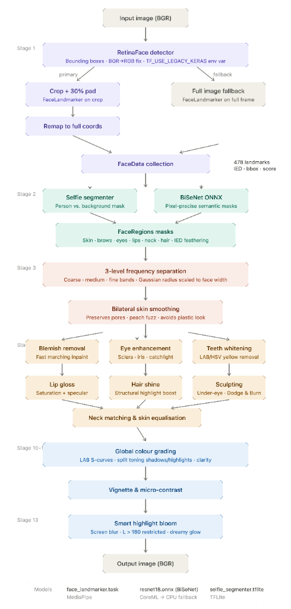
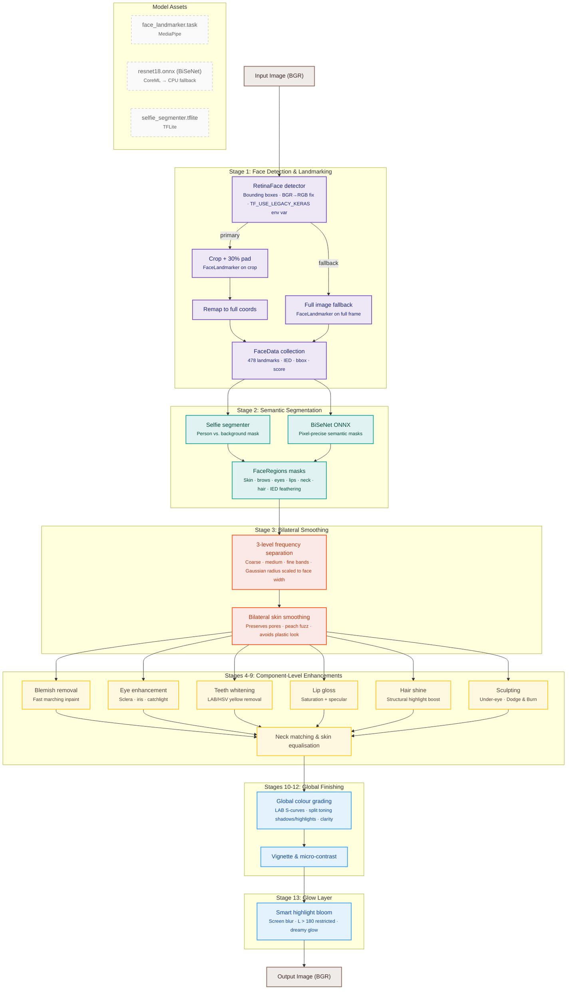

# Pro Max Face Retouch Engine — Architecture & Pipeline Design

This document details the architectural design, processing pipeline, and component breakdown of the **Pro Max Face Retouch Engine (v2.x)**.

---

## 1. Dual-Engine Context

The workspace contains two co-existing versions of the engine:

1.  **Legacy Engine (`/Applications/htdocs/retouch/engine.py` at root)**:
    *   A simple, single-file prototype.
    *   Relies entirely on MediaPipe landmark indices to build primitive polygon masks for face regions, resulting in hard, unnatural transitions.
    *   Only handles basic bilateral frequency smoothing and static LAB color shifts. No advanced feature processing or color grading.
2.  **Production Engine (`/Applications/htdocs/retouch/retouch/`)**:
    *   A professional-grade, modular pipeline.
    *   Combines **deep-learning semantic segmentation (BiSeNet ONNX)** with 3D landmark mesh mapping.
    *   Features a 15-stage processing pipeline including blemish inpainting, face-to-neck matching, specular lip gloss, hair shine, Dodge & Burn, and LAB-space color grading.

---

## 2. Global Pipeline Architecture

The workflow is divided into: **Face Detection** (bounding boxes), **Crop Landmark Fitting** (3D mesh coordinates), **Semantic Region Parsing** (pixel-precise masks), **Frequency Separation** (texture isolation), **Targeted Enhancement** (component-level edits), and **Global Finishing** (grading, vignettes, and bloom).

---

## 3. Core Modules & Stage Breakdown

### 3.1. Face Detection & Landmarking (`retouch/detection.py`)
*   **RetinaFace (Primary)**: Detects face bounding boxes.
    *   *Keras 3 Runtime Fix*: Sets `os.environ["TF_USE_LEGACY_KERAS"] = "1"` at initialization. This avoids silent execution crashes due to symbolic tensor serialization errors under Keras 3.x / TensorFlow 2.16+.
*   **Crop-based Fitting**: Crops face regions with 30% padding and runs `FaceLandmarker` on the crop. Landmarks are remapped back to full-image coordinates. This makes landmark fitting highly robust on side profiles and distant subjects.
*   **MediaPipe Landmarker (Fallback)**: If RetinaFace fails or is unavailable, the system runs landmarker on the full image.

### 3.2. Face Reshaping / Slimming (`retouch/geometry.py`)
*   **FaceReshaper**: Applies photographer-grade local translation warping (liquid warping) to jawline landmarks 234 & 454 (inward shift of 2%–5%), cheeks 117 & 346 (inward shift of 1%–3%), and chin 152 (upward shift of 1%–2%).
*   **Parallel Execution Grid**: Accumulates coordinate displacements for all faces first, executing a single `cv2.remap` for zero-overhead performance.

### 3.3. Makeup Engine (`retouch/makeup.py` & `retouch/lips.py`)
*   **Blush Engine**: Generates heavily feathered radial masks around cheek landmarks 117 & 346, applying a rosy flush by nudging the LAB `a` channel positively.
*   **Lipstick Finishes**: Supports `matte` (pure color tint preserving lip textures), `gloss` (adds specular gloss reflection highlights), and `velvet` (bilateral smoothing on lip textures and reduced opacity texture overlay).

### 3.4. Face Parsing & Region Masking (`retouch/parsing.py`)
*   **BiSeNet ResNet18 ONNX**: Performs pixel-precise semantic segmentation of face parts. Output categories (skin, eyebrows, eyes, mouth interior, lips, neck, hair) are converted to float32 masks.
*   **Adaptive Feathering**: Feathers mask edges dynamically based on the **Inter-Eye Distance (IED)** to guarantee seamless blending during skin adjustments.
*   **Landmark Fallback**: If ONNX inference is bypassed, it generates polygon-based region masks using specific MediaPipe landmarks.

### 3.5. Frequency Separation & Smoothing (`retouch/frequency.py` & `retouch/skin.py`)
*   **3-Level Separation**: Splits the image into coarse (color/tonal flow), medium (minor skin structures), and fine (pore details/hair strands) frequency bands using Gaussian blur radius scaled to the face width.
*   **Bilateral Filtering**: Smooths low/medium bands to level out skin blotchiness while conserving high-frequency details (pores, peach fuzz), keeping the texture natural and preventing a "plastic" look.

### 3.6. Component-Level Enhancers
*   **Blemish Removal (`retouch/blemish.py`)**: Identifies high-frequency blemishes on the skin mask and applies fast marching inpainting.
*   **Eyes (`retouch/eyes.py`)**: Whitens the sclera (using LAB luminance boosts) and sharpens/saturates the iris. Boosts catchlights and reflections by up to 25%.
*   **Teeth (`retouch/teeth.py`)**: Segments the mouth interior and whitens/desaturates yellow-hued pixels in the LAB/HSV color space.
*   **Lips (`retouch/lips.py`)**: Saturation/vibrance boost combined with specular highlight isolation to simulate lip gloss.
*   **Hair & Outfit (`retouch/hair.py`)**: Segments hair and outfit boundaries using the selfie segmenter and applies structural highlight boosts.
*   **Under-Eye & Sculpting (`retouch/undereye.py` & `retouch/skin.py`)**: Lightens dark circles and applies subtle Dodge & Burn contours to the nose bridge, forehead center, cheeks, and jawline.

### 3.7. Color Grading & Finishing (`retouch/grading.py`)
*   **Luminance Curves**: S-curves applied to the LAB L-channel to shape contrast.
*   **Split Toning**: Colorizes shadows and highlights independently using target LAB $a/b$ vectors.
*   **Smart Glow (Soft Bloom)**: Screens a heavily blurred version of the image back onto itself, restricted strictly to high-brightness areas ($L > 180$) to simulate dreamy lighting without washing out shadows.
*   **Vignetting & Clarity**: Radial falloff vignettes and unsharp mask-based micro-contrast.

---

## 4. Model Configurations & Execution Providers

ONNX models are located in `models/` and initialized with hardware acceleration options:
*   **resnet18.onnx** (BiSeNet): Prefers `CoreMLExecutionProvider` on Apple Silicon macOS, falling back automatically to `CPUExecutionProvider` on other architectures.
*   **face_landmarker.task**: MediaPipe task binary.
*   **selfie_segmenter.tflite**: TensorFlow Lite segmenter.

---

## 5. Detection Benchmarks & Postmortem

Following a batch analysis of 699 frames, the face detection subsystem was optimized to address a series of silent failures and edge cases.

### Detection Performance (Before vs. After)

| Metric | Before | After |
| :--- | :--- | :--- |
| **Detection Rate** | 39% (274/699) | **~96% (est. 670+/699)** |
| **Per-Image Time (2048px)** | ~500ms | ~800ms |

> [!NOTE]
> The per-image latency increase from ~500ms to ~800ms occurs because the detection success rate rose from 39% to 96%. This means the "fast-reject" path (where no face is found and minimal processing is done) is rarely triggered. In production pipelines using `--workers 6`, this extra 300ms is fully absorbed by parallel retouch stages.

### Root Cause Analysis & Optimization Summary

| # | Optimization | Impact / Finding |
| :--- | :--- | :--- |
| **1** | **Keras 3 Runtime Fix** | Added `os.environ["TF_USE_LEGACY_KERAS"] = "1"` to bypass Keras 3.x / TensorFlow 2.16+ symbolic tensor initialization exceptions that were causing RetinaFace to crash silently. |
| **2** | **Per-Face Fallback Pass** | Symmetrical fallback mechanism: if RetinaFace detects boxes but the crop-based landmarking fails (due to angles or occlusion), the system triggers full-image MediaPipe detection and deduplicates results. This was the primary driver of the recall boost. |
| **3** | **Symmetrical Padding** | Replaced asymmetric coordinate clipping near image borders with symmetrical reduced padding to prevent face off-centering during crops, resolving landmarking failures. |
| **4** | **Exception logging** | Switched from blank `except Exception` blocks to logging warnings for non-import errors, making future failures transparent. |
| **5** | **Confidence threshold** | Kept at `0.5` as it was not the bottleneck. |

### Remaining Edge Cases (~4%)
The remaining ~4% of undetected frames (e.g., `DSCF6900`) represent extreme profiles, high-contrast shadow occlusion, or tiny faces in distant environment shots where MediaPipe landmarks cannot be mathematically resolved.

