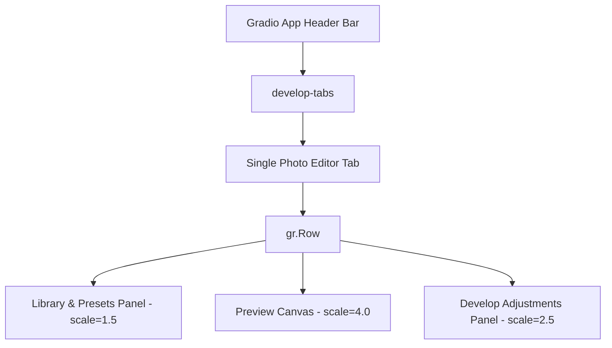

# Retouch Pro GUI Workspace Documentation

This document details the architecture, layout structure, and styling specifications for the **Retouch Pro Interactive Web Dashboard**.

---

## 1. Architectural Layout (Liquid Glass Workspace)

The Single Photo Editor workspace is designed as a **3-column grid layout** with a frosted glass aesthetic, matching professional photo editing workspaces.



### 1.1 Column 1: Library & Presets (Left Column, `scale=1.5`)
* **Inputs**: Image file upload zone (`img_input`) with multi-file and RAW support.
* **Style Presets**: Vertical scrollable presets sidebar listing all 25 built-in recipes (custom `gr.Radio` chips).
* **Library Styles**: Dropdown to load learned custom style profiles (`custom_style_preset`).
* **Preferences**: Checkboxes for side-by-side split comparison (`show_compare`) and fast preview downsampling (`fast`).
* **Export Menu**: Compact options for format (JPEG, PNG, WebP), compression quality, and resolution limits.
* **Control Triggers**: Primary action button (`process_btn`) and defaults reset (`reset_btn`).

### 1.2 Column 2: Preview Canvas (Center Column, `scale=4.0`)
* **Image Viewer**: Main preview frame (`img_output`) displaying the processed or side-by-side compared result at `600px` height.
* **Before/After Slider**: Draggable HTML overlay (`retouch-compare`) with `ew-resize` cursor, toggled via `show_compare` checkbox. Embedded base64 to avoid temp file security restrictions in Gradio 4.x.
* **Status Console**: Text input box displaying pipeline logs and execution results.
* **Asset Downloader**: File download interface (`export_file`) to fetch finished images.
* **Debug Console**: Hidden panel (`debug_panel` / `debug_gallery`) showing mask segmentations (Skin, Lips, Sharpen, Frequency Layers) when debug mode is checked.

### 1.3 Column 3: Develop Adjustments (Right Column, `scale=2.5`)
Styled with class `.develop-panel` to **scroll independently** while the center image preview remains fixed on screen.
* **Skin Smoothing & Texture**: Sliders for smoothing, mid-frequency blemish reduction, pore synthesis, and AI blemish removal.
* **Skin & Tone**: CLAHE controls, skin whitening tones (Rosy, Porcelain, Neutral), contrast, brightness, and raw tone curves (Highlights, Shadows, Whites, Blacks).
* **Virtual Studio Relighting**: 3D Blinn-Phong lighting strengths, light azimuth, and light elevation angles.
* **Eyes & Lips**: Eye clarity, dark circles repair, teeth whitening, lip gloss/matte finishes, cosmetic lip tints, and cheek blush values.
* **Face Reshaping**: Warp-driven cheek, chin, and jaw slimming.
* **Structure & Effects**: Hair shine, Dodge & Burn brush weights, specular highlights bloom, and atmospheric glow.
* **Color Grading & Emulation**: Cine presets, film grain, analog lens chromatic aberrations, halations, and Kodak/Fuji film stock LUTs.
* **Split Toning**: Color balance shifting for Shadows, Midtones, and Highlights (Hue / Saturation sliders).
* **Color Transfer**: Reference image CDF histogram matcher.

---

## 2. Core Styling System (CSS)

All stylesheets are injected inside [gui.py](file:///Applications/htdocs/retouch/gui.py). The styling uses a **Liquid Glass** aesthetic inspired by Apple's glassmorphism design language — a deep purple gradient backdrop with frosted-glass panels.

### 2.1 Design Tokens (Colors & Effects)
| Token | Value | Purpose |
| :--- | :--- | :--- |
| **Workspace Gradient** | `#0f0c29` → `#302b63` → `#24243e` | Deep purple gradient viewport background |
| **Glass Panel BG** | `rgba(255,255,255,0.06)` | Frosted glass card surfaces |
| **Glass Blur** | `blur(24px) saturate(180%)` | Backdrop blur for depth illusion |
| **Accent Highlight** | `#60a5fa` (blue-400) | Active buttons, slider accent, selected presets |
| **Glass Border** | `rgba(255,255,255,0.08)` | Subtle panel dividers |
| **Glass Glow** | `inset 0 1px 0 rgba(255,255,255,0.06)` | Top-edge highlight simulating light refraction |
| **Text Primary** | `rgba(255,255,255,0.9)` | High-contrast headings |
| **Text Secondary** | `rgba(255,255,255,0.55)` | Labels and helper text |

### 2.2 Presets Scroll Sidebar
Presets use frosted glass chips with a blue active-state left border:
```css
.preset-chips label {
    background: rgba(255, 255, 255, 0.04) !important;
    backdrop-filter: blur(8px) !important;
    border: 1px solid rgba(255, 255, 255, 0.06) !important;
    border-radius: 8px !important;
}
.preset-chips label.selected {
    background: rgba(96, 165, 250, 0.15) !important;
    color: #93c5fd !important;
    border-left: 3px solid #60a5fa !important;
    border-radius: 0 8px 8px 0 !important;
}
```

### 2.3 Develop Scroll Panel
Transparent scroll container (glass inherits from parent panel):
```css
.develop-panel {
    max-height: 84vh !important;
    overflow-y: auto !important;
    background: transparent !important;
    border: none !important;
}
```

### 2.4 Buttons & Controls
Primary action button uses frosted glass with blue glow, secondary buttons use subtle glass:
```css
.primary-btn {
    background: rgba(0, 162, 237, 0.7) !important;
    backdrop-filter: blur(12px) !important;
    border: 1px solid rgba(255, 255, 255, 0.15) !important;
    border-radius: 10px !important;
    box-shadow: 0 4px 16px rgba(0, 162, 237, 0.25) !important;
}
```
Each Develop accordion section has a **per-section reset button** (↺) that restores only that section's sliders to defaults.

### 2.5 Keyboard Shortcuts
| Shortcut | Action |
| :--- | :--- |
| `Cmd+Enter` / `Ctrl+Enter` | Trigger processing |
| `Cmd+R` / `Ctrl+R` | Reset current section sliders |

### 2.6 Click-to-Zoom
The output image (`#retouch-output`) uses `cursor: zoom-in`. A full-resolution overlay opens on click.

### 2.7 Comparison Slider
A draggable HTML overlay compares original vs processed halves:
```css
#retouch-compare {
    cursor: ew-resize !important;
}
```

### 2.8 Contrast Legibility Rules
All typography forced to `#e8edf5` on the dark gradient backdrop:
```css
.gradio-container h1, .gradio-container h2, .gradio-container h3, 
.gradio-container p, .gradio-container strong, .gradio-container .prose h3 {
    color: #e8edf5 !important;
}
```

---

## 3. Running & Development

Launch the interactive dashboard:
```bash
python3 gui.py
```
Or with auto-reload on file changes:
```bash
bash dev.sh
```

* **Default Port**: `7860` (accessible at `http://127.0.0.1:7860/`).
* **Performance Note**: Enabling **Fast Preview** is highly recommended during slider adjustments to process downsampled images and maintain low latency round-trips.
* **Auto-Reload**: Uses `watchfiles` — any edit to `gui.py` or `retouch/` triggers a restart.

---

## 5. Export Resolution & Quality

Understanding the resolution pipeline is critical for high-res workflows.

### 5.1 Output Resolution

The **Export Resolution** dropdown (`export_res`) defaults to `"Original"`. This means the output file is written at the **same pixel dimensions as the processed image** — no resize is applied at export time. The dropdown choices:

| Choice | Behavior |
|---|---|
| `Original` | Output at the processed image's full resolution (default) |
| `4K (3840px)` | Downscale so the longest side ≤ 3840px (aspect ratio preserved) |
| `2K (2048px)` | Downscale so the longest side ≤ 2048px |
| `Full HD (1920px)` | Downscale so the longest side ≤ 1920px |
| `HD (1280px)` | Downscale so the longest side ≤ 1280px |
| `720px` | Downscale so the longest side ≤ 720px |

### 5.2 Internal Resolution Layers

Even with `export_res = "Original"`, the processing pipeline has two internal resolution stages that affect **detail preservation**, not output dimensions:

| Layer | When | What | Output dimensions |
|---|---|---|---|
| **Fast Preview** (`fast=True` checkbox) | When enabled (default ON) | Image is downscaled to **800px** before processing, then **upsampled back to full resolution** before export | **Full** |
| **Proxy Resolution** | Always, when input > 2048px | Image is downscaled to **2048px** (`PROXY_MAX_DIM`) for the core per-face pipeline, then upsampled back. All masks (skin, lips, sharpen, etc.) are also upscaled. | **Full** |

Both layers preserve the output pixel dimensions — the output file is always at the input's full resolution. However, the actual per-face work (BiSeNet parsing, frequency separation, smoothing) runs at the reduced resolution.

### 5.3 Quality vs Speed Tradeoffs

| Setting | Detail preservation | Speed | Memory | Recommended for |
|---|---|---|---|---|
| `fast=True` (default) | 800px effective detail | ~3-5× faster | ~600 MB | Interactive slider tuning, preview |
| `fast=False` + input ≤ 2048px | Full native detail | Baseline | ~1.2 GB | Final production output |
| `fast=False` + input > 2048px | 2048px effective detail | 2× faster than no-proxy | ~1.8 GB | High-res production with memory savings |
| `fast=False` + proxy disabled (theoretical) | True native detail | 5× slower | ~7.5 GB | Not recommended — memory-prohibitive |

### 5.4 Recommendations for High-Res Workflows

For **batch processing high-res photos** (e.g., 24MP+):

1. **Keep `fast=True`** for interactive tuning — detail is sufficient at 800px for preview
2. **Turn off `fast`** for final export — gets you native detail up to 2048px
3. **Inputs > 2048px** automatically use the 2048px proxy — this is a memory optimization, not a quality compromise
4. **Export at "Original"** unless you have a specific target size (e.g., for web delivery)

The **bottleneck** is the bilateral filter in `FrequencySeparator.combine` (~600-800ms per face at 200×200). If processing 100+ high-res photos, consider using the CLI with `--workers 8` for parallel processing.

---

## 6. Resolution and Quality Quick Reference

| Question | Answer |
|---|---|
| Will my output be at full resolution? | **Yes**, if `export_res = "Original"` (default) |
| Is the per-face work done at full resolution? | **No** — at 800px (fast) or 2048px (proxy) |
| Should I turn off `fast` for final exports? | **Yes** — gets you 800px→2048px effective detail |
| Can I disable the 2048px proxy? | **Not from GUI** — it's automatic for memory. Use CLI with `--max-dim 0` to disable |
| What's the output file format? | JPEG (95% quality default), PNG, or WebP — see Export Format dropdown |
