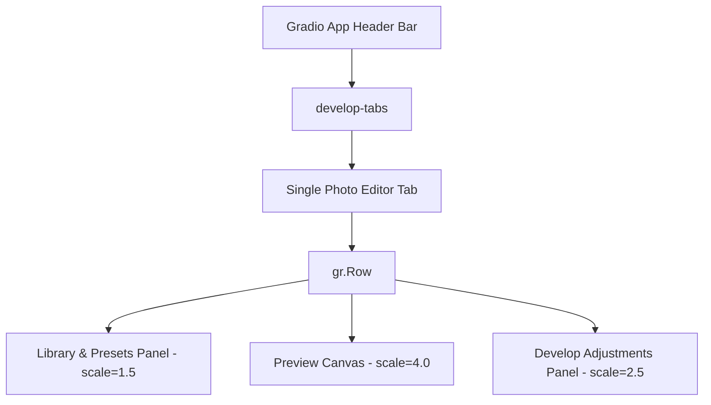

# Retouch Pro GUI Workspace Documentation

This document details the architecture, layout structure, and styling specifications for the **Retouch Pro Interactive Web Dashboard**.

---

## 1. Architectural Layout (Adobe Lightroom Style)

The Single Photo Editor workspace is designed as a **3-column grid layout** matching professional photo editing workspaces (such as Adobe Lightroom Classic).



### 1.1 Column 1: Library & Presets (Left Column, `scale=1.5`)
* **Inputs**: Image file upload zone (`img_input`) with multi-file and RAW support.
* **Style Presets**: Vertical scrollable presets sidebar listing all 25 built-in recipes (custom `gr.Radio` chips).
* **Library Styles**: Dropdown to load learned custom style profiles (`custom_style_preset`).
* **Preferences**: Checkboxes for side-by-side split comparison (`show_compare`) and fast preview downsampling (`fast`).
* **Export Menu**: Compact options for format (JPEG, PNG, WebP), compression quality, and resolution limits.
* **Control Triggers**: Primary action button (`process_btn`) and defaults reset (`reset_btn`).

### 1.2 Column 2: Preview Canvas (Center Column, `scale=4.0`)
* **Image Viewer**: Main preview frame (`img_output`) displaying the processed or side-by-side compared result at `600px` height.
* **Status Console**: Text input box displaying pipeline logs and execution results.
* **Asset Downloader**: File download interface (`export_file`) to fetch finished images.
* **Debug Console**: Hidden panel (`debug_panel` / `debug_gallery`) showing mask segmentations (Skin, Lips, Sharpen, Frequency Layers) when debug mode is checked.

### 1.3 Column 3: Develop Adjustments (Right Column, `scale=2.5`)
Styled with class `.develop-panel` to **scroll independently** while the center image preview remains fixed on screen.
* **Skin Smoothing & Texture**: Sliders for smoothing, mid-frequency blemish reduction, pore synthesis, and AI blemish removal.
* **Skin & Tone**: CLAHE controls, skin whitening tones (Rosy, Porcelain, Neutral), contrast, brightness, and raw tone curves (Highlights, Shadows, Whites, Blacks).
* **Virtual Studio Relighting**: 3D Blinn-Phong lighting strengths, light azimuth, and light elevation angles.
* **Eyes & Lips**: Eye clarity, dark circles repair, teeth whitening, lip gloss/matte finishes, cosmetic lip tints, and cheek blush values.
* **Face Reshaping**: Warp-driven cheek, chin, and jaw slimming.
* **Structure & Effects**: Hair shine, Dodge & Burn brush weights, specular highlights bloom, and atmospheric glow.
* **Color Grading & Emulation**: Cine presets, film grain, analog lens chromatic aberrations, halations, and Kodak/Fuji film stock LUTs.
* **Split Toning**: Color balance shifting for Shadows, Midtones, and Highlights (Hue / Saturation sliders).
* **Color Transfer**: Reference image CDF histogram matcher.

---

## 2. Core Styling System (CSS)

All stylesheets are injected inside [gui.py](file:///Applications/htdocs/retouch/gui.py). The styling forces a matte-charcoal workspace dark mode:

### 2.1 Design Tokens (Colors)
| Token Name | Hex Value | Purpose |
| :--- | :--- | :--- |
| **Workspace Backdrop** | `#121316` | Main body viewport background |
| **Panel Card Background** | `#1a1c22` | Layout columns and groups |
| **Header Accordion background** | `#24262d` | Collapsible Develop folder headers |
| **Accent Active Highlight** | `#00a2ed` | Lightroom Light Blue for active buttons/selected text |
| **Border Slate** | `#282b32` | Subtle layout divider line border |
| **Subtle Label Grey** | `#b0b8c6` | Low-contrast descriptor and helper texts |

### 2.2 Presets Scroll Sidebar
To mimic Lightroom's left sidebar preset navigator, `gr.Radio` is formatted vertically with custom scroll properties:
```css
.preset-chips .wrap {
    display: flex !important;
    flex-direction: column !important;
    max-height: 380px !important;
    overflow-y: auto !important;
    gap: 4px !important;
}
/* Selected active preset state with vertical highlight bar */
.preset-chips label.selected {
    background: #252830 !important;
    color: #00a2ed !important;
    border-left: 3px solid #00a2ed !important;
    border-radius: 0 4px 4px 0 !important;
}
```

### 2.3 Develop Scroll Panel
Ensures adjustments can be fine-tuned cleanly without scrolling the rest of the application layout:
```css
.develop-panel {
    max-height: 84vh !important;
    overflow-y: auto !important;
    padding-right: 6px !important;
    background: #16181c !important;
}
```

### 2.4 Contrast Legibility Rules
Standard heading and markdown outputs are forced to clean `#e2e8f0` text to prevent them from inheriting dark theme colors on charcoal background panels:
```css
.gradio-container h1, .gradio-container h2, .gradio-container h3, 
.gradio-container p, .gradio-container strong, .gradio-container .prose h3 {
    color: #e2e8f0 !important;
}
```

---

## 3. Running & Development

Launch the interactive dashboard locally:
```bash
python3 gui.py
```
* **Default Port**: `7860` (accessible at `http://127.0.0.1:7860/`).
* **Performance Note**: Enabling **Fast Preview** is highly recommended during slider adjustments to process downsampled images and maintain low latency round-trips.
