# Retouch Engine — End-to-End Image Pipeline

A Mermaid diagram of the full per-image flow, from upload to finished output. The orange `★` block is the new work from the 2026-06-23 session.

```mermaid
%%{init: {'flowchart': {'curve': 'basis', 'htmlLabels': true, 'nodeSpacing': 30, 'rankSpacing': 40}}}%%
flowchart TD
    classDef inputCls    fill:#4A90E2,stroke:#222,color:#000
    classDef detectCls   fill:#7B68EE,stroke:#222,color:#000
    classDef freqCls     fill:#FF6B6B,stroke:#222,color:#000
    classDef restoreCls  fill:#FFA500,stroke:#222,color:#000,stroke-width:3px
    classDef skinCls     fill:#FFB6C1,stroke:#222,color:#000
    classDef lightCls    fill:#FFD700,stroke:#222,color:#000
    classDef finishCls   fill:#87CEEB,stroke:#222,color:#000
    classDef gradeCls    fill:#DDA0DD,stroke:#222,color:#000
    classDef outputCls   fill:#50C878,stroke:#222,color:#000
    classDef skipCls     fill:#CCC,stroke:#666,color:#333,stroke-dasharray: 4 4
    classDef sectionCls  fill:#FFF,stroke:#222,color:#222,stroke-width:2px

    %% ── INPUT ──────────────────────────────────────────────
    subgraph S0[" INPUT "]
        INPUT["Input Image (BGR uint8)<br/>loaded by imread_exif()"]:::inputCls
    end

    %% ── PHASE 1: SETUP ─────────────────────────────────────
    subgraph S1[" PHASE 1 — SETUP "]
        direction TB
        BUILD_CTX["build_context&#40;active_recipe, rec, overrides&#41;<br/>• Recipe values resolved via PROCESSING_PARAMS spec<br/>• Caller overrides win when not None<br/>• relight resolver: skin.relight path &#40;engine fix&#41;"]:::detectCls
        DETECT["FaceDetector &#40;MediaPipe Face Landmarker&#41;<br/>faces&#91;&#93; = bbox + landmarks + ied"]:::detectCls
        PARSE["FaceParser &#40;BiSeNet ONNX + MediaPipe&#41;<br/>regions = FaceRegions&#40;skin, hair, lips, eyes,<br/>&nbsp;&nbsp;nose_bridge, cheek_highlights_l/r, under_eye, …&#41;"]:::detectCls
        PERSON["Person Segmentation &#40;MediaPipe Selfie&#41;<br/>person_mask, hair_mask"]:::detectCls
    end

    %% ── DECISION: faces? ──────────────────────────────────
    FACES{faces<br/>detected?}:::detectCls

    %% ── PHASE 2: PER-FACE ──────────────────────────────────
    subgraph S2[" PHASE 2 — PER-FACE PIPELINE  &#40;loops once per face&#41; "]
        direction TB
        CROP["_process_one_face&#40;&#41;<br/>crop ROI with safe padding"]:::skinCls
        SEP["FrequencySeparator.separate&#40;&#41;<br/>low  &#40;color/tone&#41;<br/>mid  &#40;blemishes&#41;<br/>high &#40;pores&#41;"]:::freqCls
        COMB["FrequencySeparator.combine&#40;&#41;<br/>• mid *= 1 - mask × mid_reduction<br/>• bilateralFilter&#40;low + mid&#41;<br/>• low blended with smooth_strength × 0.25 gauss<br/>• texture_opacity attenuates high band<br/>• Optional split-nose smoothing"]:::freqCls
        RESTORE["★ SkinProcessor.restore_micro_texture&#40;&#41;  &#91;NEW&#93;<br/>detail = original - smoothed<br/>dim_mask = nose_bridge + cheek_highlights<br/>&nbsp;&nbsp;+ left/right_under_eye &#40;feathered&#41;<br/>output += detail × &#40;strength/100&#41;<br/>&nbsp;&nbsp;× smooth_strength × dim_mask"]:::restoreCls
        ANIME_SKIN["★ Anime Skin Primitives &#40;new&#41;<br/>• flatten&#40;&#41;        — guided-filter cel flatting<br/>• unify_tone&#40;&#41;     — hue/chroma pull in LCH<br/>• quantize_tones&#40;&#41; — soft cel shading bands"]:::restoreCls
        SKIN["Skin &amp; Feature stages &#40;in order&#41;<br/>• equalize&#40;&#41;     — CLAHE + LAB median pull<br/>• whiten&#40;&#41;       — Rosy / Porcelain / Neutral<br/>• relight&#40;&#41;      — 3D virtual studio<br/>• specular_bloom&#40;&#41;<br/>• blemish.remove&#40;&#41;<br/>• undereye.repair&#40;&#41;<br/>• harmonize_neck&#40;&#41;<br/>• eyes + teeth + lips + blush + hair"]:::skinCls
        DODGE["SkinProcessor.dodge_burn&#40;&#41;<br/>&#40;nose_bridge brighten, jawline contour&#41;"]:::skinCls
        COMPOSITE["_composite_faces&#40;&#41;<br/>blend each face canvas back into<br/>the full-res image, accumulate masks"]:::detectCls
    end

    %% ── PHASE 3: GLOBAL ────────────────────────────────────
    subgraph S3[" PHASE 3 — GLOBAL STAGES &#40;full image&#41; "]
        direction TB
        SUBJ["_stage_subject_separation&#40;&#41;<br/>subject+0.3EV / background-0.4EV<br/>via person_mask"]:::lightCls
        GLBL["_stage_global&#40;&#41;<br/>impact finish, skin_glow &#40;anime light-wrap&#41;, bloom, glow, vignette"]:::finishCls
        GRADE["_stage_grade&#40;&#41;<br/>• tonal.apply_hd_curve&#40;&#41;<br/>• skin_protect → grader._color_ops&#40;&#41;<br/>&nbsp;&nbsp;&#40;white_balance, curves, RGB curves,<br/>&nbsp;&nbsp;shadow_lift, calibration, warmth,<br/>&nbsp;&nbsp;saturation, HSL, split_tone, clarity&#41;<br/>• highlight.apply_highlight_rolloff&#40;&#41;<br/>• apply_skin_diffusion&#40;&#41; &#91;anime light-wrap&#93;<br/>• bloom &#40;apply_global_bloom&#41;<br/>• grain, halation, chromatic_aberration<br/>• LUT application"]:::gradeCls
        FINISH["_stage_finish&#40;&#41;<br/>• color_transfer &#40;if reference image&#41;<br/>• sharpen &#40;mask-driven&#41;<br/>• auto_exposure &#40;optional&#41;<br/>• grade_intensity blend<br/>• halation overlay"]:::finishCls
    end

    %% ── NO-FACE PATH ──────────────────────────────────────
    NOFACE["No face detected<br/>→ _no_face_fallback&#40;&#41;<br/>&nbsp;&nbsp;basic tone + global stages only"]:::skipCls

    %% ── OUTPUT ────────────────────────────────────────────
    subgraph SO[" OUTPUT "]
        OUT["ProcessingResult&#40;image, skin_mask, …&#41;"]:::outputCls
    end

    %% ── EDGES ─────────────────────────────────────────────
    INPUT --> BUILD_CTX
    BUILD_CTX --> DETECT --> PARSE --> PERSON --> FACES

    FACES -->|yes| CROP
    FACES -->|no| NOFACE

    CROP --> SEP --> COMB --> RESTORE --> SKIN --> DODGE --> COMPOSITE
    COMPOSITE --> SUBJ --> GLBL --> GRADE --> FINISH --> OUT

    NOFACE -.-> SUBJ
```

## Notes

- The `★` block (`restore_micro_texture`) is the new work added in commit `5ea7ca0`. The user-pasted runtime error from this morning's `dev.sh` session is a separate bug that was fixed in `92300b1` (defensive value coercion in `process_image`).
- Everything in `xiaohongshu`, `xhs_ultrasoft`, and the new `xhs_soft_glow` recipes now flows end-to-end through the diagram. The `relight` resolver fix in `engine.py` ensures recipe values actually reach the engine (the prior hard-coded path was silently dropping them).
- The flow is vertical (top-down) to fit Markdown rendering on GitHub.
