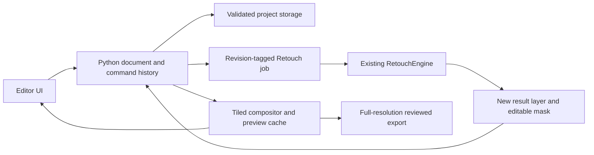

# Compositor-derived Python editor with Retouch

Date: 2026-10-07. Status: source inspected; staged implementation plan, not a completed port.

## Objective and scope

Build a local layer-based photo editor whose automatic portrait processing is
provided by the existing Retouch engine. Users can run a recipe into a new
layer, paint its mask, adjust opacity, make manual corrections, save a project,
and export the reviewed composite. Keep Retouch's CLI, batch, current desktop
launcher and video export usable throughout development.

The user requested source copying and planning for a Python conversion. The
upstream checkout is `/private/tmp/retouch-compositor-source`, pinned to
`11d8d7a50992b24fd9a760a1c13b1c01b70aaf30`. This is a temporary reference
checkout, not a published fork or a dependency installed inside Retouch.
An exact source archive, including the upstream license, is saved at
`/private/tmp/retouch-compositor-source-11d8d7a.tar.gz` (2.6 MB). Both reference
locations are temporary; preserve the archive in durable project storage before
depending on it for future development.
Its app directory contains 142 Swift files and 9 C implementation files, plus
headers and assets. This inventory is not an estimate of conversion effort.

Source: https://github.com/robbietilton/Compositor
License: MIT, copyright 2026 Wonder Assembly LLC. Preserve the upstream
copyright and complete license in all copied/translated substantial code and
distribution notices. Record the pinned origin for each ported module.

## What can be reused and what needs replacement

| Upstream area | Python implementation approach | Verification |
| --- | --- | --- |
| Document/LayerMask, LayerAdjustment, DocumentHistory | Explicit document/layer records; command-based undo; immutable source assets | Undo/redo, mask edits, transforms and dirty-state contracts |
| IO/ProjectStore, ProjectWatcher, external changes | Validated `.comp` reader/writer; atomic save; revision/digest tracking | Round trips, invalid paths/references, interruption and external-edit conflicts |
| Rendering/LayerRenderer, SeparableBlend, LiveMaskRenderer | NumPy/OpenCV tiled CPU reference renderer; explicit RGBA/alpha semantics | Transparent edges, blend modes, masks and golden composites |
| Rendering/BrushPixels.c, HealPixels.c, ContentFill.c | Inspect numerical kernels and port selectively; benchmark before replacing compiled kernels | Brush strokes, healing boundaries and captured real-photo output |
| SwiftUI/AppKit views and native dialogs | New UI; no mechanical Swift-to-Python conversion | Pointer/keyboard interaction, dialogs and accessible controls |
| Metal/Core Graphics/Core Image rendering | Backend abstraction; CPU baseline first, accelerated backend after parity | CPU/backend agreement and memory/runtime measurements |
| Apple-specific subject/object selection and RAW handling | Retouch's existing detection/parsing/input paths where suitable | Test model/format support; do not assume API equivalence |

Inspect upstream tests as behavioral references, especially ProjectTests,
LayerMaskTests, MaskTransformTests, AdjustmentLayerTests and BrushTests.
Translate relevant cases with attribution when copied. Running the upstream
Swift suite requires full Xcode; this machine currently has Command Line Tools
only. The installed Compositor app can still serve as a visual reference.

## Proposed architecture



Keep document and renderer modules independent of UI bindings. Proposed package:
`retouch/editor/{document,commands,project_store,composite,retouch_jobs}.py`.
Do not introduce a second retouch implementation or map its recipe sliders to
approximate compositor adjustments. Retouch produces actual processed pixels;
the editor controls their composition.

A Python desktop UI can use PySide6 (official Qt Python bindings), subject to
an isolated dependency/packaging and license review. It is a proposal, not an
installed dependency. Current Retouch supports Python 3.9+ and its desktop uses
pywebview/Gradio; adding Qt must not force a runtime upgrade or replace that
launcher without compatibility evidence. A web canvas in the existing shell is
an alternative if Qt cannot fit the supported runtime. Choose after the small
UI dependency spike, before implementing the full editor.

Python owns orchestration and numerical array operations. Performance-critical
work should use compiled NumPy/OpenCV operations, not Python pixel loops.
GPU parity and performance are separate milestones; Swift/Metal speed is not
automatically preserved by a Python translation.

## Milestones and completion gates

1. **Freeze the reference and establish a format/renderer harness.** Retain the
   pinned source snapshot and MIT notice, inspect relevant upstream tests,
   create small RGBA/mask fixtures and real-photo reference composites. Reconcile
   source and published format documentation; the checked-out DocumentLimits
   already differs from older documented fixed pixel budgets. Select the UI
   runtime in an isolated environment. Complete when fixtures and provenance
   are reproducible without changing the current Retouch environment.
2. **Python document core and basic composition.** Layers, order, visibility,
   opacity, Normal alpha composition, raster masks, save/open and flattened
   PNG export. Read only a declared `.comp` subset initially; reject unsupported
   semantics explicitly rather than silently flattening or losing them. Complete
   when save/load and reference compositions agree, with bounded memory and
   failure-safe saves.
3. **Runnable editor MVP.** Zoom/pan, layer panel, reorder, mask brush/erase,
   undo/redo and unsaved-change prompts. Initially bound preview resolution,
   retain native source pixels and tile exports. Complete when a user can open
   a photo, edit a mask, undo, save, reopen and export without losing edits.
4. **Retouch-powered layers.** Recipe/strength controls create a new result layer
   from a captured input/settings/document revision. Run the engine in a worker
   process; cancel cooperatively, reject stale results and reuse its model/cache
   conventions. A layer result remains baked pixels; changing its recipe reruns
   Retouch and creates a new revision. Complete when a real-photo recipe render
   is editable and the fully revealed layer reproduces the engine output.
5. **Expanded finishing tools.** Prioritize Multiply/Screen/Overlay/Difference,
   transforms, selections, clipping/group masks and grading adjustments by
   actual workflow needs. Healing/cloning follow with their own visual tests.
   Never claim all upstream modes/features are supported after the MVP.
6. **Production scale and packaging.** Dirty-tile caching, history budgets,
   crash recovery, color-managed export, representative native-resolution photo
   profiling, optional acceleration and platform packaging. Validate each OS
   actually supported before calling the editor cross-platform.

### Progress

- 2026-10-08, milestone 3: runnable editor MVP, as a web canvas inside the
  existing app window (Alex chose the canvas-in-app plan; no new dependency).
  New **Layer Editor** tab; `retouch/editor/web.py` serves the page
  (`static/editor.html`, `editor.js`) and a JSON API on the Gradio server
  under `/editor` (routes added in `gui.py`'s launch wrapper, local Host and a
  per-process token required). `session.py` holds the editor actions over
  `DocumentHistory`; `brush.py` ports upstream's mask brush (dab spacing,
  falloff, stroke-wide opacity cap); `preview.py` composites at most 2048 px
  from cached scaled copies while native pixels stay in the document. Covers
  zoom/pan, layer panel (select, show/hide, rename, reorder, delete,
  opacity, mask add/hide-all/off/delete), hide/reveal mask brush, undo/redo,
  save/save as/open `.comp`, full-size PNG export, unsaved-change prompts
  (open, page unload, desktop window close). Checked in headless Chromium
  through the real app on DSCF3503 + its `cosplay_clear_v1` render
  (open, add layer, stroke, undo, redo, save, reopen, export); export equals
  the analytic blend. Not done: painting layer pixels, tiled export (the
  composite still holds one full RGBA canvas), native-window check of the
  close prompt (pywebview needs a desktop), Mac-app parity. User guide:
  [LAYER_EDITOR.md](../guides/LAYER_EDITOR.md).
- 2026-10-07, milestone 3 foundation: `retouch.editor.DocumentHistory` adds
  validated, transactional layer add/remove/reorder, property updates, masks
  and pixel replacement, with undo/redo and saved-revision dirty tracking.
  Use its `document` snapshot for rendering; edits go through history methods.
  New documents start dirty; opened projects use `saved=True`. Its `save(path)`
  marks clean only after success; undo to that revision is clean, while a
  new edit after undo discards redo without reusing revision IDs. Metadata is
  detached and immutable arrays are shared. Defaults: 100 undo entries,
  512 MiB of unique retained array buffers (including current document).
  Old history is pruned first; if current pixels alone exceed the budget,
  retain the document and drop undo history. This does not cap total RSS.
  The layer editor UI, unsaved-change prompts and native-app parity remain
  pending; Advanced Retouch's existing history is a separate workflow.
- 2026-10-07, milestones 1-2: done in the cloud, except the parts that need a
  Mac. `retouch/editor/` holds the document model, the validated `.comp`
  reader/writer for a declared subset and the Normal-blend reference
  compositor; `third_party/compositor/` the license and provenance;
  `scripts/dev/compositor_reference.py` the real-photo check. Details,
  docs-versus-source differences, the declared subset, colour rules, evidence
  and the UI spike: [COMPOSITOR_FORMAT_NOTES.md](COMPOSITOR_FORMAT_NOTES.md).
  Still open: parity against the Mac app's own export, and the UI runtime
  choice (recommended in the notes, not decided).

Video remains on Retouch's existing tracking/stabilization/export path. A
timeline editor and per-frame layer history are a separate project.

## Color, precision and editing safety

Define working-sRGB, straight versus premultiplied alpha, RGB/BGR boundaries,
blend gamma and rounding before porting blend functions. Upstream's
SeparableBlend explicitly uses sRGB for relevant modes; linear-space blending
can produce visibly different results. Float working buffers must not be
advertised as recovering precision from 8-bit `.comp` assets. Retouch's current
high-bit export routes remain separate until a color-managed editor path is
verified. Do not copy source content credentials onto changed pixels.

Live exchange must identify the document, writer and revision; external edits
need a conflict prompt and must preserve manual work. Reloading the native app
clears its undo history. Do not continually overwrite a user's working project.
The first bridge therefore produces a new handoff per export.

## Current local work and evidence

Before the planning request, an initial `retouch/compositor.py` handoff writer,
Advanced Retouch export button and focused tests were created locally. They
remain uncommitted WIP, not the Python editor port. The writer includes a base,
masked result and hidden Difference inspection layer, uses a conservative
pixel budget and refuses existing targets. Its budget is an initial bridge
policy, not a statement of current upstream limits.

An earlier two-layer project was opened successfully in installed Compositor;
an externally added mask and changed layer name appeared live. The new
three-layer exporter generated a package, but its native-app visual verification
and complete GUI interaction verification are still pending. This evidence
does not establish feature parity or production readiness.
Focused handoff and existing GUI tests: 155 passed. Syntax checks passed.
The first sandboxed test run hit seven style-fixture permission errors; the
authorized rerun completed successfully. These tests do not verify the new
export button end to end in a browser or establish renderer parity.

Recommended next implementation: milestone 1 then the Python document/composite
core, retaining `.comp` interoperability as an acceptance test. Do not begin
with a wholesale UI rewrite or promise a one-click conversion.

## Online agent handoff

Start with this plan and `CLAUDE.md`. The local `/private/tmp` checkout and demo
are not present in a cloud workspace. Reproduce the reference with:

```bash
git clone https://github.com/robbietilton/Compositor.git /tmp/compositor-reference
git -C /tmp/compositor-reference checkout --detach 11d8d7a50992b24fd9a760a1c13b1c01b70aaf30
```

Read its `AGENTS.md`, `LICENSE`, format docs and the mapped source modules.
Keep the source as a separate reference; retain notices in anything ported.
The committed bridge is an initial interoperability slice, not a full editor.
First task: implement milestone 1's reference harness and milestone 2's document
and Normal-alpha compositor in a scoped branch. Run focused tests; do not
upgrade Retouch's pinned runtime or model dependencies to accommodate UI code.
Unsupported `.comp` constructs must fail explicitly. Preserve all unrelated
work. Report numerical checks separately from real-photo visual verification.
Native Compositor GUI checks require a Mac; headless cloud tests do not replace
them. GUI export-button interaction and the new three-layer package's visual
acceptance remain outstanding. Do not claim a completed Swift-to-Python port.

## Source links

- https://github.com/robbietilton/Compositor/blob/main/docs/project-format.md
- https://github.com/robbietilton/Compositor/blob/main/docs/writing-comp-files.md
- https://github.com/robbietilton/Compositor/blob/main/LICENSE
- https://doc.qt.io/qtforpython-6/
